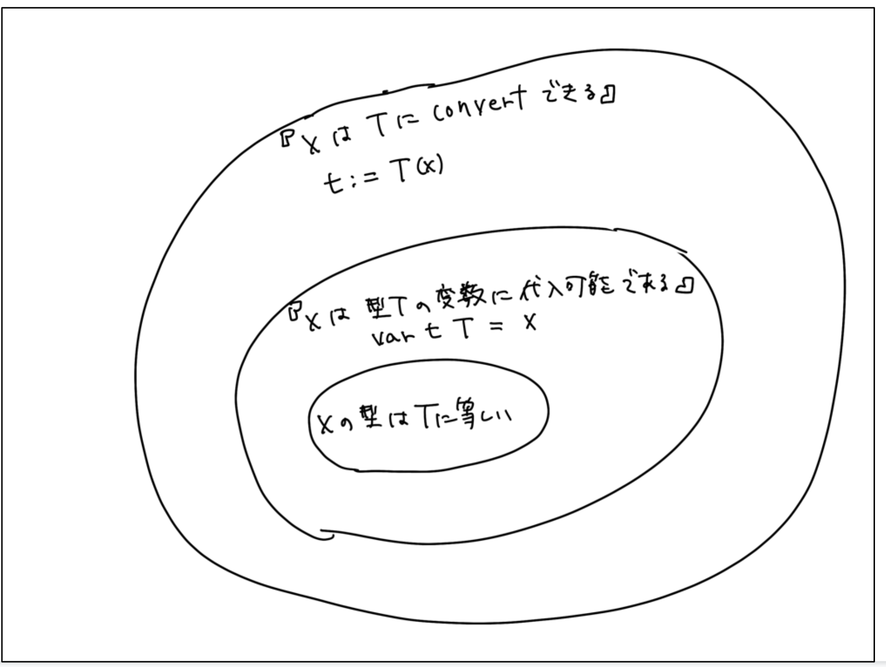

# defined type

[Go言語仕様書](https://golang.org/ref/spec)を読み進めたり、[Type Parameters Proposal](https://go.googlesource.com/proposal/+/refs/heads/master/design/go2draft-type-parameters.md)を読む上で知っていると便利な概念の一つに"[defined type](https://golang.org/ref/spec#Type_definitions)"があります。

この概念はとても重要なのですが言語仕様書上での説明がわかりにくいため、わかりやすく正確に説明するのがこの記事の目的です。

## defined type の定義

Go言語の型は、[defined type](https://golang.org/ref/spec#Type_definitions)である型と、そうでない型の2つに分けられます。

このうち、defined typeである型とは、次の2つのいずれかの型のことです:

- [型定義](https://golang.org/ref/spec#Type_definitions)によって宣言された新しい型
- [事前宣言](https://golang.org/ref/spec#Predeclared_identifiers)された型

前者の例は例えば次のようなものです。

```go
type MyInt int
// MyInt はdefined type

type MyMyInt MyInt
// MyMyInt もdefined type
```

後者の例は`int`, `string`, `bool`, `float64`などの型です。


## defined typeではない型はtype literalで表される型である

それではdefined typeではない型とはなんでしょうか？それは、「[型リテラル](https://golang.org/ref/spec#TypeLit)」で表される型です。型リテラルはさらに8種類に分けられます。いわゆる合成型を表す型がこれに当てはまります。

| 型リテラルの種類 | 具体例 |
| ---- | ---- |
| Slice型 | `[]int` | 
| Array型| `[3]int`| 
| Pointer型| `*int`| 
| Map型| `map[Key]Value`| 
| Interface型| `interface{ SomeMethod() }`| 
| Struct型| `struct { ID int}`| 
| Function型| `func(string) int`| 
| Channel型| `chan int`| 

## 例題: どれがdefined typeでしょうか？

```go
package main

type S []int
type T int
// S, T, []int, intという4つの型があるが、どれがdefined typeか？
```

**定義(再掲)**

defined typeである型とは、次の2つのいずれかの型のことです:

- 型定義によって宣言された新しい型
- 事前宣言された型

### 答え

- `S`
- `T`
- `int`

の3つがdefined typeで、`[]int`だけはdefined typeではありません。

- `S`と`T`は、型定義により宣言された新しい型であるためdefined typeです。
- `int`は、事前宣言された型であるためdefined typeです。
- `[]int`は、このいずれにも当てはまらないためdefined typeではありません。
  - 逆からみて、`[]int`は型リテラルであるのでdefined typeではない、と考えても構いません。

## defined typeの理解が役立つ場面

defined typeの理解が役立つ場面としては、次のようなものがあります。

- [型の同一性](https://golang.org/ref/spec#Type_identity)
- [代入可能性](https://golang.org/ref/spec#Assignability)
- [convert可能性](https://golang.org/ref/spec#Conversions)
- [メソッドを定義できる型とそうでない型の区別](https://golang.org/ref/spec#Method_declarations)

この最初の3つについて少し詳しくみてみましょう。

### 値`x`と型`T`の関係性

値`x`と型`T`の関係性として、次の3種類の関係があります。

- 値`x`の型と型`T`とは同一である(型の同一性)
- 値`x`は型`T`の変数に代入可能である(代入可能性)
- 値`x`は型`T`にconvert可能である(convert可能性)

これらの成り立つ条件は包含関係にあり、「型の同一性」が最も狭く、「convert可能性」が最も広い、という関係にあります。




それではこの集合の差分はどのような場合なのでしょうか？実は、この差の部分を記述するために、"defined type"の概念が使われています。詳しく知りたいかたは、Go言語仕様書を確認してみてください。

## まとめ

Go言語の型は、[defined type](https://golang.org/ref/spec#Type_definitions)である型と、そうでない型の2つに分けられます。

このうち、defined typeである型とは、次の2つのいずれかの型のことです:

- 型定義によって宣言された新しい型
- 事前宣言された型

逆に、defined typeではない型は、型リテラル(type literal)で表される型です。


