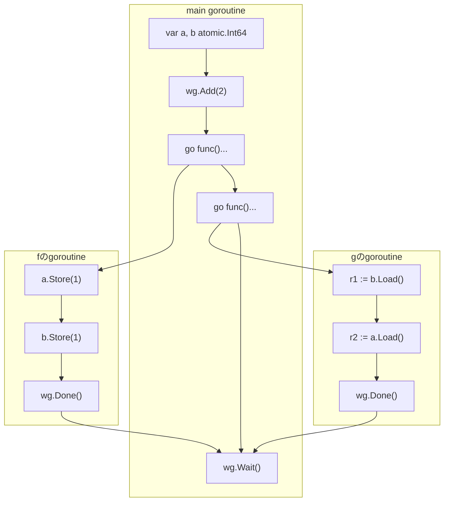

## この章のゴール

- Go1.19のメモリーモデルアップデートの内容がわかります
- sync/atomicが何なのかわかります
- sync/atomicを使ったプログラムをメモリーモデルで分析できます

**Keywords:**

- sync/atomic
- 暗黙的全順序(implicit total order)

## Go1.19のメモリーモデルアップデート(8年ぶり)

Go 1.19では、The Go Memory Modelが8年ぶりに大きく改訂されました。C++やJava、Rustなど他言語のメモリーモデルと足並みをそろえる形で全体が書き直され、より正確でフォーマルな記述になりました。

## なぜsync/atomicについて話すのか

この章でsync/atomicを取り上げるのは、Go1.19メモリーモデルで記述が追加された部分だからです。

- ※しかも理解しづらい

## sync/atomic入門

整数の値を1つインクリメントする`increment`関数を使って説明します。4つの書き方で`increment`を書いてみます。

```go
var x int64 = 0
var m sync.Mutex

// 単純なincrement.
// 並行プログラムでは意図通りに動かない
func increment() {
    x += 1
}

// Mutexを使ってインクリメント
func incrementByMutex() {
    m.Lock()
    x += 1
    m.Unlock()
}

// 同じことをatomicsで書く
func incrementByAtomics() {
    atomic.AddInt64(&x, 1)
}

// Go1.19からはatomics専用の型が使えます
// よりコンパクトで間違えにくい書き方ができます
var y atomic.Int64

func betterIncrementByAtomics() {
    y.Add(1)
}
```

## sync/atomicのメモリーモデルをざっくり説明

このsync/atomicのメモリーモデルをざっくり説明すると、**「sync/atomicだけで書かれたGoプログラムは逐次一貫モデルで説明できる」**ということを知っておけば良いです。

- 逐次一貫モデル = 第2章のGopherくんの考え方
- 大雑把に言えば、何らかの方法で同期演算を一列に並べたものとしてhappens-beforeグラフを書けば良い

sync/atomicとふつうの演算が混ざったプログラムの場合は次のようになります（※本書では割愛）。

1. まずsync/atomicの部分について逐次一貫モデルで観測可能性を求める
2. 次にふつうの演算のhappens-before関係を求めて、2つを合成する
3. 最終的なhappens-before関係から観測可能性を決定する

※もう少し詳しくは付録の章で説明します。

## 【練習】Quiz (Message Passing) のatomicバージョン

それを確かめるために、Message Passing Testをatomic型を使って書き換えた問題を考えてみます。`int64`の代わりに、`atomic.Int64`を使うようにしたわけですね。

```go
var a, b atomic.Int64 // 0で初期化
var wg sync.WaitGroup

func f() {
	defer wg.Done()
	a.Store(1)
	b.Store(1)
}

func g() {
	defer wg.Done()
	r1 := b.Load()
	r2 := a.Load()
	if r1 == 1 && r2 == 0 {
		panic("Answer: Yes")
	}
}

// 実験を1回行う関数
func exec() {
	wg.Add(2)
	defer wg.Wait()
	go f()
	go g()
}
```

### 先に実験しておく

**問題: `(r1, r2) = (1, 0)`となることはあるか？**

実験結果: **NO**。オリジナルのMessage Passing Testと違って、いくら回してもpanicは発生しません。


*atomic.Int64を使ったMessage Passing Testの実験。panicは発生しない*

### このクイズを解く手順

これをメモリーモデルの考え方で説明するには、一手間必要です。それはatomic演算同士の順序が完全には確定していないからです。そこで4つの演算を一列に並べる方法を全て列挙して、それぞれに対するグラフを使って観測可能性を求める流れになります。

1. 演算を図に書き起こす
2. 確定できるhappens-before関係を書き足す
3. 4つのatomic演算を一列に並べる全てのパターンを列挙する
   - それぞれのパターンに対して、happens-before関係を書き足す
   - それぞれのパターンに対して、できあがったグラフを使って観測可能性を判定する

まず、すでに学んだ方法で書ける部分についてはグラフを書き上げてしまいます。



### パターン1（※全部で6パターン）

4つのatomic演算を`a.Store(1)` → `r1 := b.Load()`のように一列に並べるパターンは、第2章で数えたのと同じく全部で6通りあります。

1つ目のパターンとして、`a.Store(1)` → `b.Store(1)` → `r1 := b.Load()` → `r2 := a.Load()`の順に並べた場合を考えます。このパターンに対しては、次の2つのhappens-before関係をグラフに書き足します。

- `[a.Store(1)] < [r2 := a.Load()]`
- `[b.Store(1)] < [r1 := b.Load()]`

これで全てのhappens-before関係を書き込むことができました。このグラフから観測可能性を読み取ってみます。

- `b.Load()`は`b.Store(1)`だけを観測可能
- `a.Load()`は`a.Store(1)`だけを観測可能
- 故に`(r1, r2) = (1, 1)`

### パターン2（※全部で6パターン）

次に、4つのatomic演算を別な方法で並べるパターンを考えます。`a.Store(1)` → `r1 := b.Load()` → `r2 := a.Load()` → `b.Store(1)`のような並びです。このパターンに対しては、次の2つのhappens-before関係をグラフに書き込みます。

- `[a.Store(1)] < [r2 := a.Load()]`
- `[r1 := b.Load()] < [b.Store(1)]`

このグラフから観測可能性を読み取ると、

- `b.Load()`は初期化演算だけを観測可能
- `a.Load()`は`a.Store(1)`だけを観測可能
- 故に`(r1, r2) = (0, 1)`

となります。

### 残りのパターンと結論

パターンは全部で6パターンありますが、残りの4パターンは省略します。それぞれのパターンに対して別個のhappens-beforeグラフが作られます。これは、プログラムの実行ごとに異なるグラフになりうると考えてください。

残りの4パターンも考えると、どのhappens-beforeグラフに対しても`(r1, r2) = (1, 0)`とはならないことがわかります。

**結論: sync/atomicを使った場合のMessage Passingにおいて、`(r1, r2) = (1, 0)`となることはありえない**（※実験してもそのようなパターンは発生しない）

## Quiz (Message Passing Test) の結果を振り返って解釈する

- Message Passing Quizをsync/atomicで解いた場合の答えは、Message Passing Quizを逐次一貫モデルで解いた場合の結論と同じだった
- これは偶然ではなく、**sync/atomicだけを使って書いたプログラムは逐次一貫モデルで説明できる**という事実の一例になっている
- また、sync/atomicは単に「atomic(分割できない)」なだけでなく、**happens-before関係を作り出す働き（同期演算としての性質）** も併せ持っている
