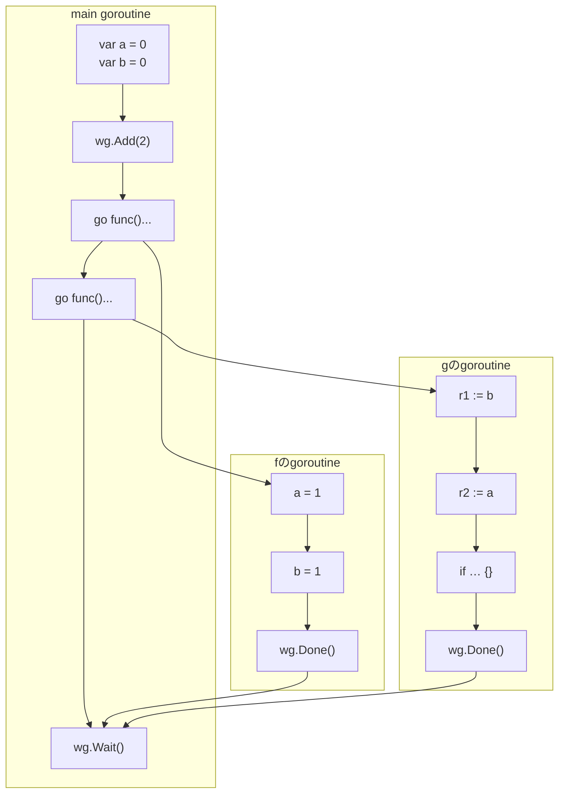

以下は発表のおまけスライド（ドラフトも含む）を書籍化したものです。

## 逐次一貫的ではないatomicsも存在しうる

- Go言語では逐次一貫的なatomicsだけが提供されている
  - 理由は [research!rsc: Updating the Go Memory Model (Memory Models, Part 3)](https://research.swtch.com/gomm) に詳しい
- より緩やかな性質を持つatomicsを選べる言語もある
  - C++, Rust…
  - このような選択肢のことを「メモリオーダリング」と呼ぶ

## 付録: Quiz: Message Passing Testの詳しい解き方

第3章の練習問題では結論だけを示しました。ここでは観測可能性の導出を詳しく追いかけます。

解き方の流れは次の3ステップです。

1. プログラムからメモリ演算を図に書き出す
2. 図にhappens-before関係を書き込んでグラフにする
3. 観測可能性の仕様を使って、`[r1 := b]`と`[r2 := a]`それぞれが観測可能な書き込み演算を全て求める

ステップ1と2を終えたグラフは次の通りです（第3章と同じもの）。

ここで、「メモリーモデルによる観測可能性の仕様」をもう一度貼り付けておきます。これを使って、`[r1 := b]`と`[r2 := a]`から観測できる書き込み演算を全て求めるのが目標です。

> 次の2つのうちどちらかの条件が成り立つとき、またその場合に限り、rはwを観測できる
> 1. `w < r`であり、かつ、`w < w' < r`となるような他の書き込み演算`w'`が存在しない
> 2. `r`と`w`が並行である

### `r1 := b`が観測可能な`b`への書き込み演算を全て求める

- 初期化の`[var b = 0]`
  - `[var b = 0] < [r1 := b]`
  - この2つの間に`b`への書き込みはない
  - よって`[r1 := b]`は`[var b = 0]`を**観測可能**
- `f`のgoroutineの`[b = 1]`
  - `[b = 1] < [r1 := b]`ではない
  - `[r1 := b] < [b = 1]`でもない
  - つまり2つは並行
  - よって`[r1 := b]`は`[b = 1]`を**観測可能**

### `r2 := a`が観測可能な`a`への書き込み演算を全て求める

- 初期化の`[var a = 0]`
  - `[var a = 0] < [r2 := a]`
  - この2つの間に`a`への書き込みはない
  - よって`[r2 := a]`は`[var a = 0]`を**観測可能**
- `f`のgoroutineの`[a = 1]`
  - `[a = 1] < [r2 := a]`ではない
  - `[r2 := a] < [a = 1]`でもない
  - つまり2つは並行
  - よって`[r2 := a]`は`[a = 1]`を**観測可能**

以上により、`r1`も`r2`も0と1のどちらの値も取りうるので、`(r1, r2) = (1, 0)`もあり得ることが導けました。

## sync/atomicについてのhappens-before関係

sync/atomicは同期演算の一種なので、同期演算一般について書いてある記述の通りにhappens-before関係が決まります。

- 同期演算: channel, mutex, sync/atomicなど
- 同期演算ではないもの: `a = 1`とかの普通のメモリ読み書き

## 同期演算についての記述

The Go Memory Modelの同期演算に関する記述（Requirement 2）を引用します。

> Requirement 2: For a given program execution, the mapping W, when limited to synchronizing operations, must be explainable by some implicit total order of the synchronizing operations that is consistent with sequencing and the values read and written by those operations.
>
> The synchronized before relation is a partial order on synchronizing memory operations, derived from W. If a synchronizing read-like memory operation r observes a synchronizing write-like memory operation w (that is, if W(r) = w), then w is synchronized before r. Informally, the synchronized before relation is a subset of the implied total order mentioned in the previous paragraph, limited to the information that W directly observes.
>
> — [The Go Memory Model](https://go.dev/ref/mem) より

発表者による意訳は次の通りです。

> 要請2: 与えられたプログラム実行に対して、マッピングWを同期演算に限定したとき、それは同期演算の暗黙的全順序により説明可能であり、かつその全順序はこれらの演算で読み書きされる値や順序と一貫していなければならない。
>
> synchronized before関係は、同期的メモリ演算に対する半順序関係であり、Wから導出される。もし同期的read-like演算であるrが同期的write-like演算wを観測するならば（つまり、W(r) = wであるならば）wはrよりもsynchronized beforeである。インフォーマルに言うと、synchronized before関係は前の段落で言及した暗黙的な全順序の部分集合、つまりWが直接観測する情報に限った部分集合である。
>
> happens before関係は、sequenced before関係とsynchronized before関係との推移的閉包として定義される。

## すこし噛み砕いた（？）説明

- **暗黙的全順序**: 演算を一列に並べたものとして振る舞いを説明できる
- **マッピングW**: 観測可能性（の数学的表現）のこと
  - `W(r) = w`のとき、rはwを観測できる
