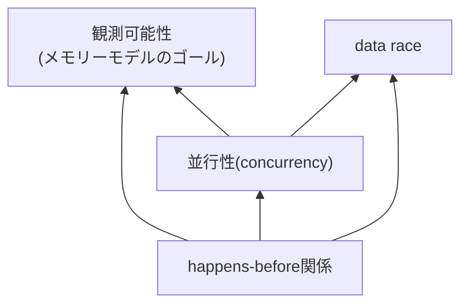
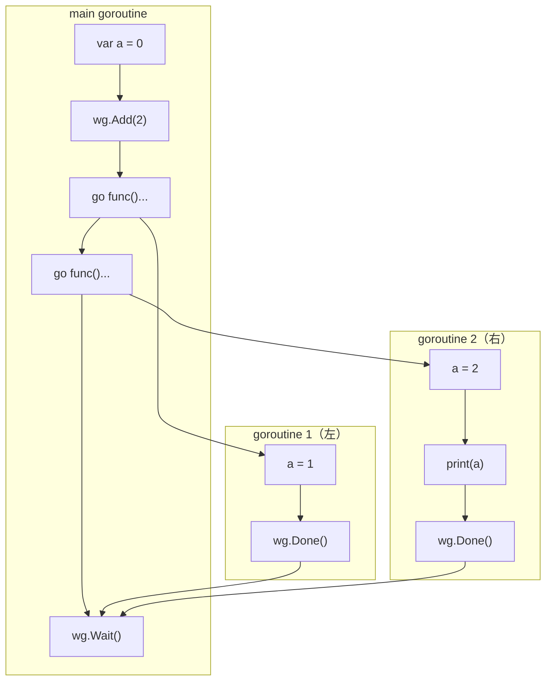
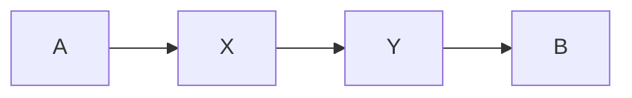
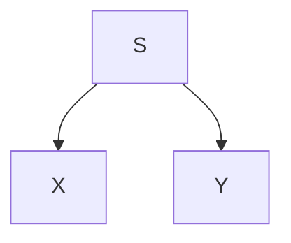
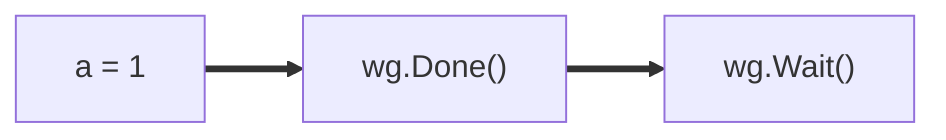
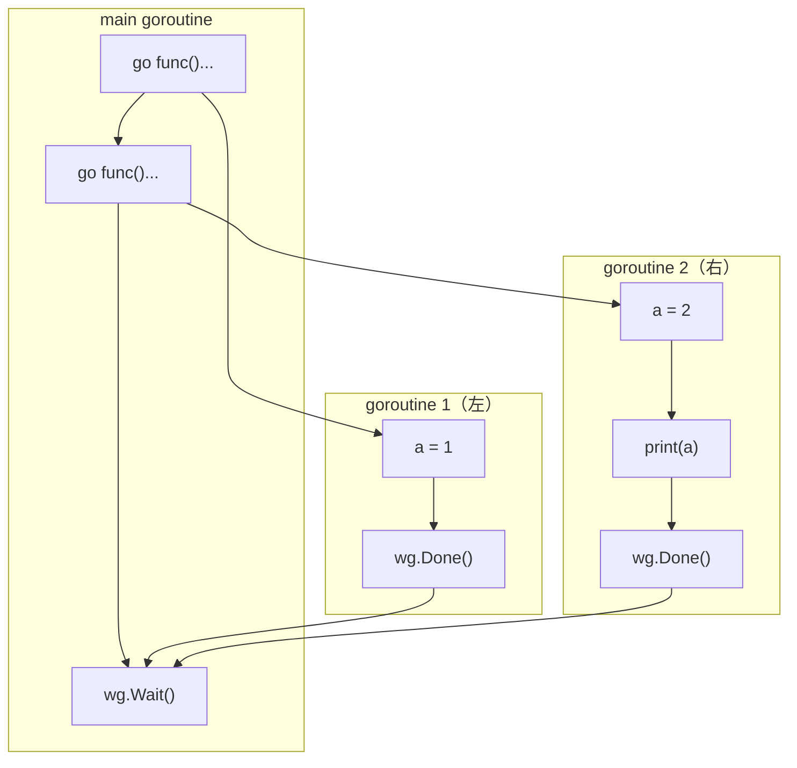
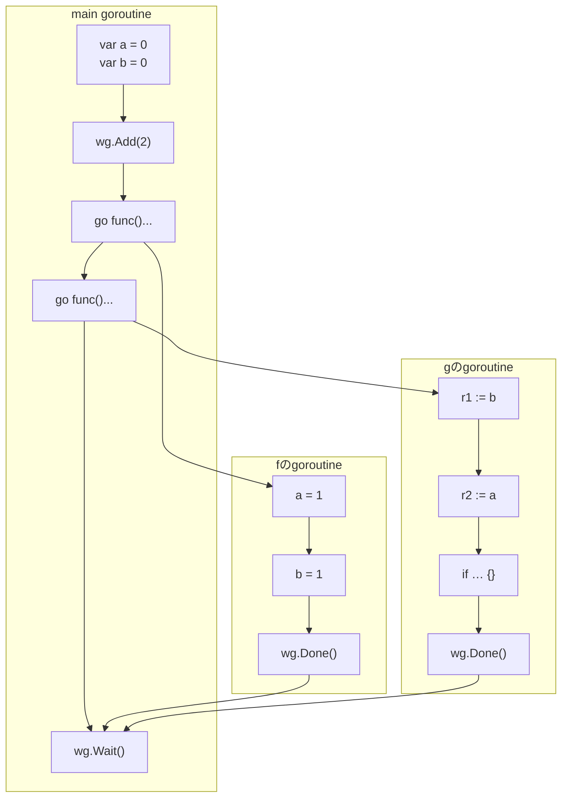

## The Go Memory Modelの目標

ここでGoメモリーモデルの本文の最初の部分を少し読んでみましょう。

> The Go memory model specifies the conditions under which reads of a variable in one goroutine can be guaranteed to observe values produced by writes to the same variable in a different goroutine.
>
> — [https://go.dev/ref/mem#introduction](https://go.dev/ref/mem#introduction) より

拙訳:

> Goメモリーモデルは、あるgoroutineで行われる読み込み(read)演算が、同一の変数に対して別なgoroutineで行われる書き込み(write)演算によって作られる値を観測することが保証されるための条件を特定する。

## Go Memory Model概念相関図

Go Memory Modelを読んでいて迷子にならないためには、いま述べたメモリーモデルのゴールと、そのためのマイルストーンの関係をあらかじめ知っておくことが役に立ちます。そのために書いたのが次のチャートです。



この図は、矢印のスタート地点にあるものを使ってゴール地点にあるものが定義されることを示しています。つまりこの図は、「観測可能性」を求めるためには「happens-before関係」を求める必要がある、ということを表しています。

そこで、まずhappens-before関係を理解しましょう。

## happens-before関係は2つの演算の間の関係である

`a`, `b`が相異なる演算であるとき、次の3つのいずれか1つのみが必ず成り立ちます。

1. a happens before b
   - `a < b`とも書きます
2. b happens before a
   - `b < a`とも書きます
3. 上記のどちらも成り立たない
   - この場合、「aとbは並行(concurrent)である」といいます

:::message alert
**注意（罠）!**
"happens-before" を直訳して、「先に起こる」と解釈しないでください（重要）。
メモリーモデルは「観測可能性」を定めるものであり、happens-before関係はそのための「概念的道具」にすぎません。なぜ「先に起こる」と読んではいけないのかは、観測可能性を学んだ後の「なぜ『先に起こる』と解釈してはいけないのか」の節で説明します。
:::

## happens-before関係はグラフで求められる

happens-before関係は、グラフを描くことで求められます。「グラフの描き方」と「グラフの読み方」の2段階で説明します。

**happens-before関係のグラフの描き方（3段階）**

1. 実行される演算を図に書き出す
2. 同一goroutineの演算同士は、プログラムに書かれた順序通りに矢印を書く
3. 異なるgoroutineの演算同士は、所定の同期演算でペアが作れる場合に矢印を書く

**happens-before関係のグラフの読み方（2つのルール）**

1. AからBに矢印を通ってたどり着けるとき A happens before B
   - `A < B`とも書く
2. AとBがお互いに矢印を通ってたどり着けないとき、AとBはconcurrent

## happens-before関係のグラフの描き方

次のプログラムに対して、happens-before関係をグラフで描いてみます。

```go
var a = 0

func main() {
    var wg sync.WaitGroup
    wg.Add(2)
    go func() {
        a = 1
        wg.Done()
    }()
    go func() {
        a = 2
        print(a)
        wg.Done()
    }()
    wg.Wait()
}
```

- main goroutineを含めて3つのgoroutineがあります
- main goroutineではWaitGroupを使った待ち合わせ処理を書いています
- 2つめのgoroutineでは`a`に1を書き込んでいます
- 3つめのgoroutineでは`a`に2を書き込んでから、`a`を読み込みして`print`しています

このように3つのgoroutineからなるプログラムについて、happens-beforeグラフを書いていきたいと思います。

**第一段階**として、プログラムで実行される演算を全て書き出します。ここで、同じgoroutineに属する演算は縦に並べておきます。見やすいように、main goroutineの演算を真ん中の列に書き、左側は1つ目に起動されるgoroutine、右側は2つ目に起動されるgoroutineとします。

**第二段階**では、同一goroutineの演算同士を、プログラムに書かれた順序通りに矢印を書いて繋ぎます。左のgoroutineの演算を上から下に矢印で繋ぎ、main goroutineの演算も上から下に繋ぎ、右のgoroutineの演算も上から下に繋ぎます。

**第三段階**では、横に並んでいる異なるgoroutineの演算同士のうち、メモリーモデルで決められた所定のペアについて、矢印で繋ぎます。この所定のペアのことを、**同期演算**と呼びます。

- まず、goroutineを起動する`go`文と、起動されるgoroutineのスタートになるノードを繋ぎます
- 次に、WaitGroupの`Done`メソッドから`Wait`メソッドに向かって矢印を描いて繋ぎます

:::message
「どの演算がどこにどんな矢印を作るのか」の正確なリストは、第5章で扱います。実は、WaitGroupの矢印はThe Go Memory Model本文ではなくsyncパッケージのドキュメントで保証されているものなのですが、これも第5章で説明します。この章では「同期演算が矢印を作る」という枠組みだけ押さえてください。
:::

完成したグラフは次のようになります。happens-before関係のグラフの書き方は、これで全部です。



## happens-before関係のグラフの読み方

以上でhappens-before関係のグラフを描き上げることができました。これだけだと、このグラフが何の役に立つのか、どういう意味なのかがまだわかりません。そこでこれから、happens-before関係のグラフの読み方を見ていきます。これには2つのルールがあります。

### ルール1: AからBに向かって到達できるとき、A happens before B

すごろくのようにAからスタートして、矢印の向きを辿ってBにたどり着ける形になっているとき、「A happens before B」つまり「AはBよりもhappens before」であると解釈します。


*Aから矢印を辿っていくとBにたどり着けるので、A happens before B（`A < B`）と解釈する。間に他の演算を挟んでいても構わない*

この言い方はまどろっこしいので、数式を使って`A < B`とも書くことがあります。この方が便利なので、本書でも積極的にこの書き方を使っていきます。

### ルール2: XからYへもYからXへも到達できないとき、XとYは並行(concurrent)

XからYに向かって矢印を辿って辿り着くことはできず、逆にYからXに向かって辿り着くこともできない。このようなとき、「XとYは並行の関係にある」という意味に読みます。


*XからYへも、YからXへも矢印を辿って到達できないので、XとYは並行(concurrent)と解釈する*

happens-beforeグラフは、この2つのルールだけ覚えれば正しく解釈することができます。

### 【練習】happens-before関係のグラフの読み方

happens-beforeグラフを読む練習として、先ほどのサンプルプログラムから作ったグラフを考えてみましょう。なお、以下では個々の演算を`[ ]`で囲み、`[a = 1]`のように表記します。


まず、左のgoroutineにある`a = 1`という書き込み演算と、main goroutineにある`wg.Wait()`に着目します。グラフを見ると、`a = 1`から矢印の向きを守って`wg.Wait()`にたどり着けることがわかると思います。着目する部分だけ抜き出すと、次のようになります。


*`a = 1`から`wg.Done()`を経由して`wg.Wait()`まで、矢印を辿って到達できる（太字の矢印がhappens-before関係を示す経路）*

よって、1つ目のルールにより、

- `[a = 1]` happens before `[wg.Wait()]`
  - `[a = 1] < [wg.Wait()]`とも書く

となります。

次に、`a = 1`と`print(a)`の関係を考えると、お互いに矢印を辿って到達することができません。着目する部分だけ抜き出すと、次のようになります。



よって2つ目のルールにより、

- `[a = 1]`と`[print(a)]`は並行(concurrent)

となります。

## 概念相関図を埋めていく

これで、与えられたプログラムに対してhappens-before関係のグラフを書く方法がわかりました。概念相関図のマイルストーンを埋めていきましょう。

**並行性(concurrency)の定義**は、すでにグラフの読み方のルール2として学んだ通りです。

> メモリー演算a, bについて、次のどちらも成り立たないとき、「aとbは並行である」という
> - `a < b`
> - `b < a`

**data race**というのもすぐわかるので説明しておくと、これは並行性の特別な場合になっています。

> メモリー演算a, bについて、次が成り立つときaとbはdata raceの関係にある:
> - aとbは並行である
> - aとbの対象メモリー位置が重なっている
> - aとbの少なくともどちらかが書き込み演算である
> - a, bの少なくともどちらかが同期演算(※channelやsync/atomicなど)ではない

これで必要なマイルストーンをクリアしたので、最終目標である「観測可能性」に取り掛かっていきましょう。

## 観測可能性の仕様

まずは文章と数式によるフォーマルな説明を読んでから、図で具体的に説明していきたいと思います。

**状況設定**

- 同一のメモリー位置（変数）に対する2つのメモリー演算`r`と`w`がある
- `r`は読み込み演算である(read)
- `w`は書き込み演算である(write)

**観測可能性の仕様**

> 次の2つのうちどちらかの条件が成り立つとき、またその場合に限り、rはwを観測できる
> 1. `w < r`であり、かつ、`w < w' < r`となるような他の書き込み演算`w'`が存在しない
> 2. `r`と`w`が並行である

条件1は直観に合うと思います。「rの前に行われた最新の書き込みを読む」ということだからです。

一方、条件2は多くの人にとって直観に反するはずです。「並行**なのに**観測できる」とはどういうことでしょうか。並行というのは、happens-beforeグラフの上で`r`と`w`の順序がどちらとも決まっていない、ということでした。順序が決まっていない以上、メモリーモデルは「wの値を読む」とも「読まない」とも断定できません。そこでメモリーモデルは、**どちらの結果もあり得るものとして扱う**という立場を取ります。「観測できる」は「必ず観測する」ではなく「観測するかもしれない（それも正しい実行結果である）」という意味です。data raceのあるプログラムの結果が実行ごとに変わりうるのは、まさにこの条件2が発動しているからです。

## happens-before関係のグラフから観測可能性を読みとる

先ほどのサンプルプログラムのグラフを使って、変数`a`に対する読み込み演算`[print(a)]`について考えます。観測可能な書き込み演算の候補は`[var a = 0]`, `[a = 1]`, `[a = 2]`の3つあります。


**`[var a = 0]`は`[print(a)]`から観測可能か？**

- `[var a = 0] < [print(a)]`は満たしている
- しかし`[a = 2]`という別な書き込み演算があって、`[var a = 0] < [a = 2] < [print(a)]`
- よって条件1を満たさず、`[print(a)]`は`[var a = 0]`を**観測できない**

**`[a = 2]`は`[print(a)]`から観測可能か？**

- `[a = 2] < [print(a)]`を満たしている
- 間に挟まる別な書き込み演算はない
- よって条件1により、`[print(a)]`は`[a = 2]`を**観測できる**

**`[a = 1]`は`[print(a)]`から観測可能か？**

- `[a = 1]`と`[print(a)]`は並行である
- よって条件2により、`[print(a)]`は`[a = 1]`を**観測できる**

ここまで読んでこられた皆さんは、Goメモリーモデルに基づいて観測可能性をどう判断すればいいかを完全に理解できたことになります。大きな流れをおさらいすると、まずプログラムを見てhappens-before関係をグラフに書きます。そしてそのグラフを使って、読み込み演算のありうる結果を観測可能性のルールで判断する、という流れです。

## なぜ「先に起こる」と解釈してはいけないのか

この章の最初に「happens-beforeを『先に起こる』と解釈しないでください」という注意を出しました。観測可能性まで学んだ今なら、その理由を説明できます。

まず、happens-before関係が**ない**ことは、「観測されない」ことを意味しません。先ほどの例で、`[a = 1]`と`[print(a)]`は並行であり、どちらかが「先」だという関係は一切ありませんでした。それにもかかわらず、条件2により`[print(a)]`は`[a = 1]`を観測**できる**のでした。happens-beforeを「時間的に先に起こること」と読んでいると、「先に起こっていないのに値が見える」というこの状況を理解できなくなります。

逆に、happens-before関係が**ある**ことも、「実際にその時刻順で実行される」ことを意味しません。第2章で見たとおり、data raceのあるプログラムでは「全ての演算が何らかの時刻順で一列に実行された」という説明自体が成り立たないのでした。コンパイラやCPUは、観測可能性のルールを破らない限り、演算を並べ替えて実行して構いません。

つまりhappens-before関係とは、実行時刻の前後関係ではなく、**「どの読み込みがどの書き込みを観測しうるか」を決めるためだけに定義された、論理的な順序づけ**です。「先に起こる」という時間のイメージではなく、「観測可能性を計算するための矢印」として扱うのが安全です。

## 🎉 ここまでお疲れ様でした！🎉

これでThe Go Memory Modelの核心部分は完全に理解できたことになります🎉

【練習】として、前の章で出てきたQuiz: Message Passing Testの正しい解き方を見ておきましょう。

## 【練習】観測可能性を考えてQuiz: Message Passing Testを正しく解こう

問題をもう一度確認します。

```go
var a, b int
var wg sync.WaitGroup

func f() {
    defer wg.Done()
    a = 1
    b = 1
}

func g() {
    defer wg.Done()
    r1 := b
    r2 := a
    if r1 == 1 && r2 == 0 { // これは発生しうるか？
        panic("Answer: Yes") // 発生したらpanicしてプログラム終了
    }
}

// 実験を1回行う関数
func exec() {
    wg.Add(2)
    defer wg.Wait() // f, gの完了を待ち合わせる
    go f()
    go g()
}
```

**問題: `(r1, r2) = (1, 0)`となることにより、このプログラムがpanicすることはあり得るか？（実験による答え: YES）**

正しい答え(YES)をメモリーモデルを使って導いてみましょう。

### 解き方の流れ

1. プログラムからメモリー演算を図に書き出す
2. 図にhappens-before関係を書き込んでグラフにする
3. 観測可能性の仕様を使って、`[r1 := b]`と`[r2 := a]`それぞれが観測可能な書き込み演算を求める
4. `(r1, r2) = (1, 0)`となるパターンがありうるか判断する

ここでは、簡単のために、happens-before関係のグラフが完成したところからスタートしたいと思います。次に示すのが完成したグラフです。



ここから観測可能性のルールを適用することで、`r1`の値と`r2`の値としてありうる結果がメモリーモデルによってわかります。導出で使う「観測可能性の仕様」を再掲しておきます。

> 次の2つのうちどちらかの条件が成り立つとき、またその場合に限り、rはwを観測できる
> 1. `w < r`であり、かつ、`w < w' < r`となるような他の書き込み演算`w'`が存在しない
> 2. `r`と`w`が並行である

これを使って、`[r1 := b]`と`[r2 := a]`から観測できる書き込み演算を全て求めます。

### `r1 := b`が観測可能な`b`への書き込み演算を全て求める

- 初期化の`[var b = 0]`
  - `[var b = 0] < [r1 := b]`
  - この2つの間に`b`への書き込みはない
  - よって`[r1 := b]`は`[var b = 0]`を**観測可能**
- `f`のgoroutineの`[b = 1]`
  - `[b = 1] < [r1 := b]`ではない
  - `[r1 := b] < [b = 1]`でもない
  - つまり2つは並行
  - よって`[r1 := b]`は`[b = 1]`を**観測可能**

### `r2 := a`が観測可能な`a`への書き込み演算を全て求める

- 初期化の`[var a = 0]`
  - `[var a = 0] < [r2 := a]`
  - この2つの間に`a`への書き込みはない
  - よって`[r2 := a]`は`[var a = 0]`を**観測可能**
- `f`のgoroutineの`[a = 1]`
  - `[a = 1] < [r2 := a]`ではない
  - `[r2 := a] < [a = 1]`でもない
  - つまり2つは並行
  - よって`[r2 := a]`は`[a = 1]`を**観測可能**

### 結論

- `r1 := b`の結果は0でも1でも良い
- `r2 := a`の結果は0でも1でも良い
- つまり次の4通りの結果はどれもあり得る
  - `(r1, r2) = (0, 0)`
  - `(r1, r2) = (0, 1)`
  - `(r1, r2) = (1, 0)`
  - `(r1, r2) = (1, 1)`
- よって、`(r1, r2) = (1, 0)`もあり得るので、Quizの答えは**YES**（起こり得る）

## それでも`(r1, r2) = (1, 0)`が起こることに納得がいかない

「Gopherくんの考え方のどこが間違っていたのか」の節の内容を思い出すことが、納得するために役立つと思います。私たちは無意識に「演算は何らかの順序で一列に実行される」という逐次一貫モデルを仮定してしまいがちですが、data raceのあるプログラムではその仮定自体が成り立たないのでした。

## この章のまとめ

- メモリーモデルのゴールは「観測可能性」を定めることであり、happens-before関係はそのための概念的道具である
- happens-before関係はグラフを描いて求められる
  - 同一goroutineの演算はプログラム順に矢印で繋ぐ
  - 異なるgoroutine間は同期演算のペアがあるときに矢印で繋ぐ
- グラフ上でAからBに到達できるとき`A < B`（A happens before B）、お互いに到達できないときAとBは並行(concurrent)
- 読み込み演算`r`が書き込み演算`w`を観測できるのは、(1) `w < r`かつ間に他の書き込みが挟まらないとき、または (2) `r`と`w`が並行であるとき
- 観測可能性の仕様を使うことで、Message Passing Testの答え(YES)を正しく導出できる

**Keywords:**

- 観測可能性
- happens-before関係
- 並行性(concurrency)
