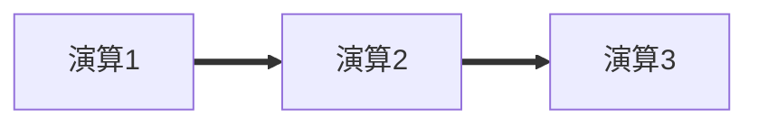
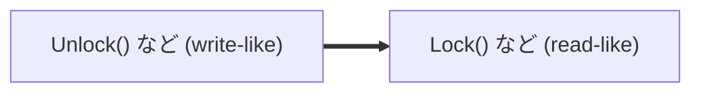
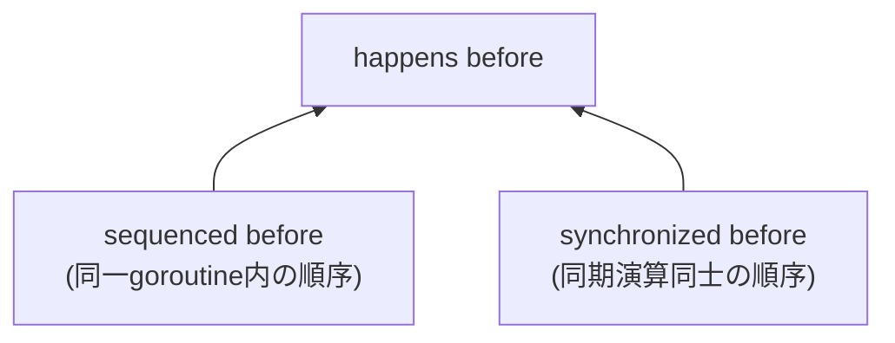

## この章で扱うこと

第3章では、happens-before関係を求める手順を次の3段階で説明しました。

1. 実行される演算を図に書き出す
2. 同一goroutineの演算同士は、プログラムに書かれた順序通りに矢印を書く
3. 異なるgoroutineの演算同士は、所定の同期演算でペアが作れる場合に矢印を書く

そして、この矢印をたどって到達できるかどうかでhappens-before関係を判定する、と説明しました。

実はこの手順は、The Go Memory Modelが定義する2つの関係――**sequenced before**と**synchronized before**――をグラフの言葉に翻訳したものだったのです。次章では「synchronized before」という言葉がそのまま登場するので、ここでその正体を確認しておきましょう。

## sequenced before: 同一goroutine内の順序

The Go Memory ModelのRequirement 1を見てみましょう。

> Requirement 1: The memory operations in each goroutine must correspond to a correct sequential execution of that goroutine, given the values read from and written to memory. That execution must be consistent with the sequenced before relation, defined as the partial order requirements set out by the Go language specification for Go's control flow constructs as well as the order of evaluation for expressions.
>
> — [https://go.dev/ref/mem](https://go.dev/ref/mem) より

拙訳:

> 要請1: 各goroutine内のメモリ演算は、そのメモリに対して読み書きされた値を踏まえた、そのgoroutineの正しい逐次実行に対応していなければならない。その実行は、sequenced before関係と整合していなければならない。sequenced before関係は、Go言語仕様が定めるGoの制御構文についての半順序、および式の評価順序によって定義される。

要するに、**sequenced before**とは、同一goroutine内で「プログラムに書かれた順序」（およびGo言語仕様が定める式評価順序などの細部）のことです。第3章の「グラフの描き方・第二段階」――同一goroutineの演算同士を、プログラムに書かれた順序通りに矢印を書く――は、まさにこのsequenced before関係を矢印にしていたわけです。


*同一goroutine内でプログラムに書かれた順序が、そのままsequenced before関係になる*

:::message
**補足: 「式の評価順序」について**

sequenced before関係は「同一goroutine内でプログラムに書かれた順序」とざっくり説明しましたが、正確には**単一の式の中での評価順序**まで踏み込んで規定されています。The Go Programming Language Specificationの「Order of evaluation」の節には、次のように書かれています。

> At package level, initialization dependencies determine the evaluation order of individual initialization expressions in variable declarations. Otherwise, when evaluating the operands of an expression, assignment, or return statement, all function calls, method calls, receive operations, and binary logical operations are evaluated in lexical left-to-right order.
>
> — [https://go.dev/ref/spec#Order_of_evaluation](https://go.dev/ref/spec#Order_of_evaluation) より

拙訳:

> パッケージレベルでは、初期化の依存関係が、変数宣言における個々の初期化式の評価順序を決定する。それ以外の場合、式・代入・return文のオペランドを評価する際には、全ての関数呼び出し・メソッド呼び出し・受信操作・二項論理演算は、字面上の左から右への順序で評価される。

ポイントは、「左から右に評価される」と保証されているのは**関数呼び出し・メソッド呼び出し・受信操作(`<-c`)・論理演算(`&&`, `||`)同士の間の順序だけ**だということです。それ以外の、ただの変数の読み出しなどとの相対順序は規定されていません。仕様書に載っている次の例がわかりやすいです。

```go
a := 1
f := func() int { a++; return a }
x := []int{a, f()} // xは[1, 2]にも[2, 2]にもなりうる：aとf()の評価順序は規定されていない
```

`x`の1つ目の要素は単なる変数`a`の読み出し、2つ目の要素は関数呼び出し`f()`です。この2つは「関数呼び出し同士」ではないので、左から右に評価される保証の対象外です。そのため、コンパイラが先に`f()`を評価して`a`を2にしてから1つ目の要素（`a`）を読み出せば`x`は`[2, 2]`に、先に1つ目の要素（`a`＝1）を読んでから`f()`を評価すれば`x`は`[1, 2]`になります。どちらの結果も、仕様上は正しい実行結果です。

つまり、「sequenced before」は単に行の順序だけでなく、こうした式レベルの評価順序の規定も含めて定義されている、という点を覚えておいてください。
:::

## synchronized before: goroutineをまたぐ順序

続いてRequirement 2です。次章で「同期演算」と呼ぶものの正体がここに書かれています。

> Requirement 2: For a given program execution, the mapping W, when limited to synchronizing operations, must be explainable by some implicit total order of the synchronizing operations that is consistent with sequencing and the values read and written by those operations.
>
> The synchronized before relation is a partial order on synchronizing memory operations, derived from W. If a synchronizing read-like memory operation r observes a synchronizing write-like memory operation w (that is, if W(r) = w), then w is synchronized before r. Informally, the synchronized before relation is a subset of the implied total order mentioned in the previous paragraph, limited to the information that W directly observes.
>
> — [https://go.dev/ref/mem](https://go.dev/ref/mem) より

拙訳:

> 要請2: 与えられたプログラム実行に対して、マッピングWを同期演算に限定したとき、それは同期演算の暗黙的全順序により説明可能であり、かつその全順序はこれらの演算で読み書きされる値や順序と一貫していなければならない。
>
> synchronized before関係は、同期的メモリ演算に対する半順序関係であり、Wから導出される。もし同期的read-like演算であるrが同期的write-like演算wを観測するならば（つまり、W(r) = wであるならば）wはrよりもsynchronized beforeである。インフォーマルに言うと、synchronized before関係は前の段落で言及した暗黙的な全順序の部分集合、つまりWが直接観測する情報に限った部分集合である。

ここでの**マッピングW**は「観測可能性」の数学的な表現で、`W(r) = w`は「読み込み演算rが書き込み演算wを観測する」ことを意味します（第3章の観測可能性の仕様を思い出してください）。

つまり、**synchronized before**とは、channel・mutex・sync/atomicなどの「同期演算」同士の間に成り立つ順序関係のことです。第3章の「グラフの描き方・第三段階」――所定の同期演算でペアが作れる場合に矢印を書く――は、このsynchronized before関係を矢印にしていたのでした。


*同期演算同士の間で成り立つ順序が、synchronized before関係になる*

## happens before = 2つの関係の推移的閉包

そして、いよいよhappens beforeの正式な定義です。

> The happens before relation is defined as the transitive closure of the union of the sequenced before and synchronized before relations.
>
> — [https://go.dev/ref/mem](https://go.dev/ref/mem) より

拙訳:

> happens before関係は、sequenced before関係とsynchronized before関係の和集合の、推移的閉包として定義される。

「推移的閉包」と言うと難しく聞こえますが、第3章で学んだ「矢印をたどって到達できるかどうか」と全く同じことです。

- sequenced before → 同一goroutine内の矢印（第二段階）
- synchronized before → 同期演算の矢印（第三段階）
- happens before → その2種類の矢印を辿って到達できること


*happens beforeは、sequenced beforeとsynchronized beforeという2種類の矢印の「たどり着けるかどうか」として定義される*

第3章でグラフを描いたとき、私たちはすでにこの定義の通りに手を動かしていたことになります。

## この章のまとめ

- The Go Memory Modelは、happens beforeを直接定義するのではなく、**sequenced before**と**synchronized before**という2つの関係の推移的閉包として定義している
- sequenced beforeは、同一goroutine内でプログラムに書かれた順序（Go言語仕様が定める制御構文・式評価順序）のこと
- synchronized beforeは、channel・mutex・sync/atomicなどの同期演算同士の間に成り立つ順序のこと
- 第3章のhappens-beforeグラフの「第二段階」はsequenced beforeを、「第三段階」はsynchronized beforeを、それぞれ矢印として描いていた
- 次章では、この**synchronized before**という言葉を使って、個々の同期演算がどんな順序関係を作るのかを見ていく

**Keywords:**

- sequenced before
- synchronized before
- 推移的閉包(transitive closure)
