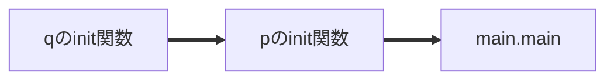
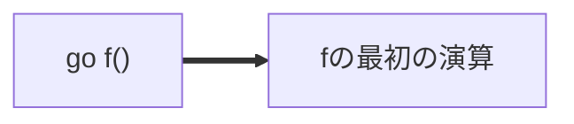
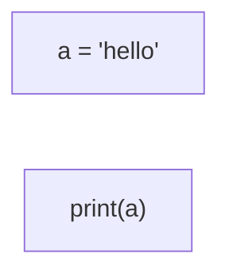
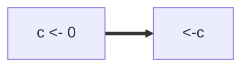
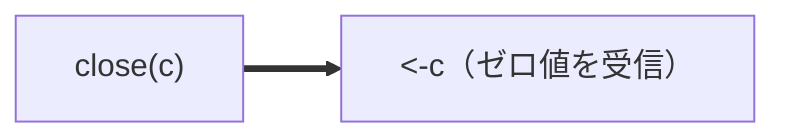
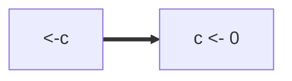
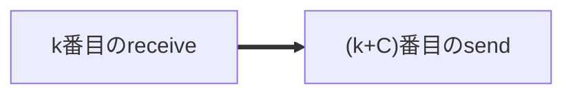
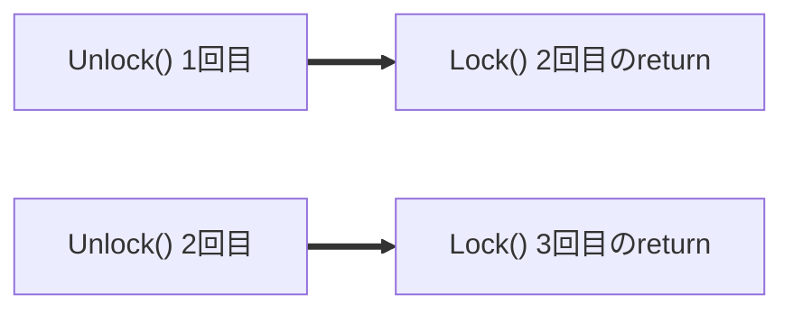
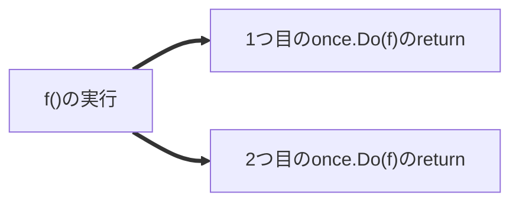

## この章で扱うこと

前章では、happens-before関係の正体が**sequenced before**と**synchronized before**という2つの関係の推移的閉包であることを学びました。同一goroutine内の順序がsequenced before、**同期演算**と呼ばれる特定のペアがgoroutineをまたいで作る順序がsynchronized beforeでした。しかし前章では、「具体的にどんな同期演算が、どんなsynchronized before関係を作るのか」については深入りしませんでした。

The Go Memory Modelには、まさにこの疑問に答える **Synchronization** という節があります。ここには、Go言語が提供する同期の仕組み一つひとつについて、どのようなsynchronized before関係(＝矢印)を作り出すのかが規定されています。

この章では、Synchronization節に列挙されている同期演算を一つずつ取り上げ、前章で学んだsynchronized beforeの言葉で解釈していきます。

## 初期化(Initialization)

> If a package p imports package q, the completion of q's init functions happens before the start of any of p's.
>
> The completion of all init functions is synchronized before the start of the function main.main.
>
> — [https://go.dev/ref/mem#init](https://go.dev/ref/mem#init) より

拙訳:

> パッケージpがパッケージqをimportしているとき、qのinit関数群の完了は、pのinit関数群の開始よりhappens beforeである。
> 全てのinit関数群の完了は、`main.main`関数の開始よりsynchronized beforeである。

矢印で書くと、次のようになります。


*パッケージのimport関係と`main.main`の間には、必ずこの順序で矢印が引かれる*

普段あまり意識しませんが、これのおかげで「importされているパッケージのグローバル変数は、importする側の`main`関数が始まる前に必ず初期化が終わっている」ことが保証されているわけです。

**Go Playgroundで実行できる例:**

複数パッケージをまたぐ例はPlayground上では作りにくいので、ここでは1つのパッケージの中で「パッケージレベル変数の初期化 → `init`関数 → `main`関数」という順序が必ず守られることを確認します。

```go
package main

import "fmt"

var greeting = initGreeting()

func initGreeting() string {
	fmt.Println("1: package-level var initialization")
	return "hello"
}

func init() {
	fmt.Println("2: init function")
}

func main() {
	fmt.Println("3: main.main, greeting =", greeting)
}
```

何度実行しても、必ず`1`→`2`→`3`の順に出力されます。

## goroutineの生成(Goroutine creation)

> The go statement that starts a new goroutine is synchronized before the start of the goroutine's execution.
>
> — [https://go.dev/ref/mem#go](https://go.dev/ref/mem#go) より

拙訳:

> 新しいgoroutineを開始する`go`文は、そのgoroutineの実行開始よりsynchronized beforeである。

これは第3章のサンプルプログラムのグラフで、`GO1 --> A1`のような矢印としてすでに登場していました。


*`go`文自体が、新しいgoroutineの最初の演算へのsynchronized before関係を作る*

**Go Playgroundで実行できる例:**

The Go Memory Modelの例をそのままプログラムにしたものです（`f`の実行完了を待つために`sync.WaitGroup`を足しています）。

```go
package main

import (
	"fmt"
	"sync"
)

var a string

func f(wg *sync.WaitGroup) {
	defer wg.Done()
	fmt.Println(a)
}

func hello(wg *sync.WaitGroup) {
	a = "hello, world"
	wg.Add(1)
	go f(wg)
}

func main() {
	var wg sync.WaitGroup
	hello(&wg)
	wg.Wait()
}
```

`go`文が実行される前に`a = "hello, world"`が完了しているので、`f`は必ず`"hello, world"`を観測します。`-race`オプション付きで実行してもdata raceは報告されません。

## goroutineの終了(Goroutine destruction)

ここが重要な注意点です。

> The exit of a goroutine is not guaranteed to be synchronized before any event in the program.
>
> — [https://go.dev/ref/mem#goexit](https://go.dev/ref/mem#goexit) より

拙訳:

> goroutineの終了は、プログラム中のどんなイベントに対してもsynchronized beforeであることが保証されない。

つまり、「goroutineが終わったこと」自体は、他のどんな演算とも矢印で結ばれません。


*goroutineの終了そのものからは矢印が引かれないので、`a = "hello"`と`print(a)`の間にhappens-before関係はできない（＝観測できるとは限らない）*

これが、これまでの章でMessage Passing Testなどの例において、goroutineの完了を`sync.WaitGroup`で明示的に待ち合わせていた理由です。goroutineが実行を終えるだけでは、その中で行われた書き込みが他のgoroutineから観測可能になる保証はありません。何らかの同期演算（次以降で説明するchannelやlockなど）を使って、明示的にhappens-before関係を作る必要があります。

**Go Playgroundで実行できる例:**

こちらもThe Go Memory Modelの例そのままです。今度はあえて同期を入れていません。

```go
package main

import "fmt"

var a string

func hello() {
	go func() { a = "hello" }()
	fmt.Println(a)
}

func main() {
	hello()
}
```

`main`はgoroutineの完了を待たずに`fmt.Println(a)`を実行するので、多くの場合は空文字列が出力されます（`go`文で起動したgoroutineが実際に走り出す前に`main`が終わってしまうため）。仕様上「絶対にこうなる」という保証はなく、実装やスケジューラの都合でたまたま`"hello"`と表示されることもあり得ます。どちらの結果になっても、それは仕様違反ではありません。

## チャネル通信(Channel communication)

チャネルは、goroutine間の同期の主要な手段です。The Go Memory Modelでは、チャネルについて複数のルールが規定されています。

**ルール1: sendは対応するreceiveの完了よりsynchronized beforeである**

> A send on a channel is synchronized before the completion of the corresponding receive from that channel.
>
> — [https://go.dev/ref/mem#chan](https://go.dev/ref/mem#chan) より


*送信は、対応する受信の完了よりsynchronized beforeである*

**Go Playgroundで実行できる例:**

```go
package main

import "fmt"

var c = make(chan int, 10)
var a string

func f() {
	a = "hello, world"
	c <- 0
}

func main() {
	go f()
	<-c
	fmt.Println(a)
}
```

`main`が`<-c`で受信を完了できるのは、`f`の中で`c <- 0`が実行された後です。そして`c <- 0`が実行されるのは`a = "hello, world"`の後（sequenced before）なので、`main`の`fmt.Println(a)`は必ず`"hello, world"`を観測します。

**ルール2: closeはゼロ値を返すreceiveよりsynchronized beforeである**

> The closing of a channel is synchronized before a receive that returns a zero value because the channel is closed.
>
> — [https://go.dev/ref/mem#chan](https://go.dev/ref/mem#chan) より



**Go Playgroundで実行できる例:**

先ほどの例の`c <- 0`を`close(c)`に置き換えただけです。

```go
package main

import "fmt"

var c = make(chan int)
var a string

func f() {
	a = "hello, world"
	close(c)
}

func main() {
	go f()
	<-c
	fmt.Println(a)
}
```

`main`の`<-c`は、チャネルが`close`されたことによってゼロ値を受信して完了します。この場合も`fmt.Println(a)`は必ず`"hello, world"`を観測します。

**ルール3(unbufferedチャネル限定): receiveは対応するsendの完了よりsynchronized beforeである**

バッファなしチャネルに限り、ルール1とは逆方向の関係も成り立ちます。

> A receive from an unbuffered channel is synchronized before the completion of the corresponding send on that channel.
>
> — [https://go.dev/ref/mem#chan](https://go.dev/ref/mem#chan) より


*バッファなしチャネルでは、受信の開始が送信の完了よりsynchronized beforeになる（送信側は受信が始まるまでブロックされるため）*

**Go Playgroundで実行できる例:**

送信と受信を入れ替え、チャネルをバッファなしにしました。

```go
package main

import "fmt"

var c = make(chan int)
var a string

func f() {
	a = "hello, world"
	<-c
}

func main() {
	go f()
	c <- 0
	fmt.Println(a)
}
```

`main`側の`c <- 0`は、`f`側の`<-c`が受信を開始するまでブロックされます。バッファなしチャネルでは受信の開始が送信の完了よりsynchronized beforeなので、`c <- 0`が完了した時点（＝`main`が`fmt.Println(a)`に進める時点）で`a = "hello, world"`は必ず完了しています。もし`c = make(chan int, 1)`のようにバッファ付きにすると、このルールは成り立たなくなり、`"hello, world"`が表示される保証はなくなります。

:::message
バッファ付きチャネルではこの逆方向の関係は成り立ちません。バッファ付きチャネルの場合は、代わりに次のルールが成り立ちます。
:::

**ルール4(bufferedチャネル限定): k番目のreceiveは(k+C)番目のsendよりsynchronized beforeである**

> The kth receive on a channel with capacity C is synchronized before the completion of the k+Cth send from that channel.
>
> — [https://go.dev/ref/mem#chan](https://go.dev/ref/mem#chan) より

これは、容量`C`のバッファ付きチャネルを「カウンティングセマフォ」として使うときの根拠になるルールです。



**Go Playgroundで実行できる例:**

The Go Memory Modelに載っている「容量3のカウンティングセマフォ」の例です（元の例は`select{}`で永久にブロックして終わるので、Playground上で終了できるように`sync.WaitGroup`で全タスクの完了を待つ形に変えています）。

```go
package main

import (
	"fmt"
	"sync"
)

var limit = make(chan int, 3)

func main() {
	work := []func(){
		func() { fmt.Println("task 1 done") },
		func() { fmt.Println("task 2 done") },
		func() { fmt.Println("task 3 done") },
		func() { fmt.Println("task 4 done") },
		func() { fmt.Println("task 5 done") },
	}
	var wg sync.WaitGroup
	for _, w := range work {
		wg.Add(1)
		go func(w func()) {
			defer wg.Done()
			limit <- 1
			w()
			<-limit
		}(w)
	}
	wg.Wait()
}
```

`limit`チャネルの容量が3なので、同時に実行されるタスクは最大3つに制限されます。どのタスクがどの順番で終わるかは実行のたびに変わりますが（並行に走っているので）、5つ全てが必ず出力されます。

## ロック(Locks)

`sync.Mutex`と`sync.RWMutex`について、次のルールがあります。

> For any sync.Mutex or sync.RWMutex variable l and n < m, call n of l.Unlock() is synchronized before call m of l.Lock() returns.
>
> — [https://go.dev/ref/mem#locks](https://go.dev/ref/mem#locks) より

拙訳:

> 任意の`sync.Mutex`または`sync.RWMutex`型の変数`l`について、`l.Unlock()`のn回目の呼び出しは、`l.Lock()`のm回目の呼び出しがreturnするより前にsynchronized beforeである（ただし n < m）。

これは、チャネルのように「対応する1つの相手」があるわけではなく、**それまでに行われた全てのUnlock呼び出しが、それより後のLock呼び出しにsynchronized beforeになる**、という点がポイントです。


*ロックの獲得・解放は、鎖のように一列につながっていく*

**Go Playgroundで実行できる例:**

```go
package main

import (
	"fmt"
	"sync"
)

var l sync.Mutex
var a string

func f() {
	a = "hello, world"
	l.Unlock()
}

func main() {
	l.Lock()
	go f()
	l.Lock()
	fmt.Println(a)
}
```

`main`は`l.Lock()`を2回呼んでいます。1回目の`Lock`はすぐに成功しますが、2回目の`Lock`は`f`の中の`l.Unlock()`が呼ばれるまでブロックされます。`f`内の`Unlock()`呼び出しは`a = "hello, world"`の後（sequenced before）なので、`main`が2回目の`Lock()`から復帰した時点で`fmt.Println(a)`は必ず`"hello, world"`を観測します。

## Once

`sync.Once`は、複数のgoroutineが同時に`once.Do(f)`を呼び出しても、`f`がちょうど1回しか実行されないことを保証する仕組みです。

> The completion of a single call of f() from once.Do(f) is synchronized before the return of any call of once.Do(f).
>
> — [https://go.dev/ref/mem#once](https://go.dev/ref/mem#once) より

拙訳:

> `once.Do(f)`から呼ばれる`f()`のただ1回の呼び出しの完了は、`once.Do(f)`のどの呼び出しのreturnよりもsynchronized beforeである。


*`f()`の完了から、全ての`once.Do(f)`呼び出しのreturnに向かって矢印が引かれる*

**Go Playgroundで実行できる例:**

The Go Memory Modelの例に、完了待ち合わせ用の`sync.WaitGroup`を足したものです。

```go
package main

import (
	"fmt"
	"sync"
)

var a string
var once sync.Once

func setup() {
	a = "hello, world"
}

func doprint(wg *sync.WaitGroup) {
	defer wg.Done()
	once.Do(setup)
	fmt.Println(a)
}

func twoprint() {
	var wg sync.WaitGroup
	wg.Add(2)
	go doprint(&wg)
	go doprint(&wg)
	wg.Wait()
}

func main() {
	twoprint()
}
```

`setup`（つまり`f`）は必ず1回しか実行されませんが、`once.Do(setup)`を呼び出した2つのgoroutineはどちらも、`setup`の完了後でなければ`once.Do`から返ってきません。そのため、`fmt.Println(a)`は2回とも必ず`"hello, world"`を出力します。

## sync/atomicとsync.WaitGroupについて

sync/atomicについては、次章でこれまでとは異なる角度から詳しく扱うため、ここでは割愛します。

また、これまでの章の例で使ってきた`sync.WaitGroup`は、実はThe Go Memory Model本文の**Synchronization節には登場しません**。`WaitGroup`のようなsyncパッケージの追加的な機構については、それぞれのAPIドキュメントが個別に保証内容を定めることになっています。`WaitGroup`の場合は、あるgoroutineの`Done()`呼び出しによってカウンタがゼロになることが、対応する`Wait()`の返却よりsynchronized beforeになる、という趣旨の保証がドキュメント化されています。本書ではこれ以上深入りしませんが、「Synchronization節に載っていない同期の仕組みも存在する」ということは覚えておいてください。

## この章のまとめ

- The Go Memory Modelの**Synchronization**節は、Go言語の同期の仕組みそれぞれについて、どんなsynchronized before関係(矢印)を作るかを規定している
- 初期化: importされるパッケージのinitは、importする側のinitより先に完了する。全てのinitは`main.main`の開始より先に完了する
- goroutineの生成: `go`文は、新しいgoroutineの最初の演算とsynchronized before関係を持つ
- goroutineの終了: goroutineの終了それ自体は、何ともsynchronized before関係を持たない。効果を他のgoroutineに観測させるには明示的な同期が必要
- チャネル通信: sendは対応するreceiveの完了とsynchronized before関係を持つ（unbufferedの場合は逆方向も成り立つ）。バッファ付きチャネルではk番目のreceiveが(k+C)番目のsendとsynchronized before関係を持つ
- ロック: n回目のUnlockは、それより後のm回目のLockのreturnとsynchronized before関係を持つ
- Once: `f()`の完了は、全ての`once.Do(f)`呼び出しのreturnとsynchronized before関係を持つ
- `sync.WaitGroup`などSynchronization節に載っていない同期の仕組みは、それぞれのAPIドキュメントが保証内容を個別に定めている

**Keywords:**

- Synchronization
- synchronized before
- 初期化(Initialization)
- goroutineの生成・終了
- チャネル通信
- ロック(Mutex)
- sync.Once
