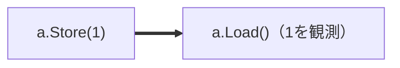
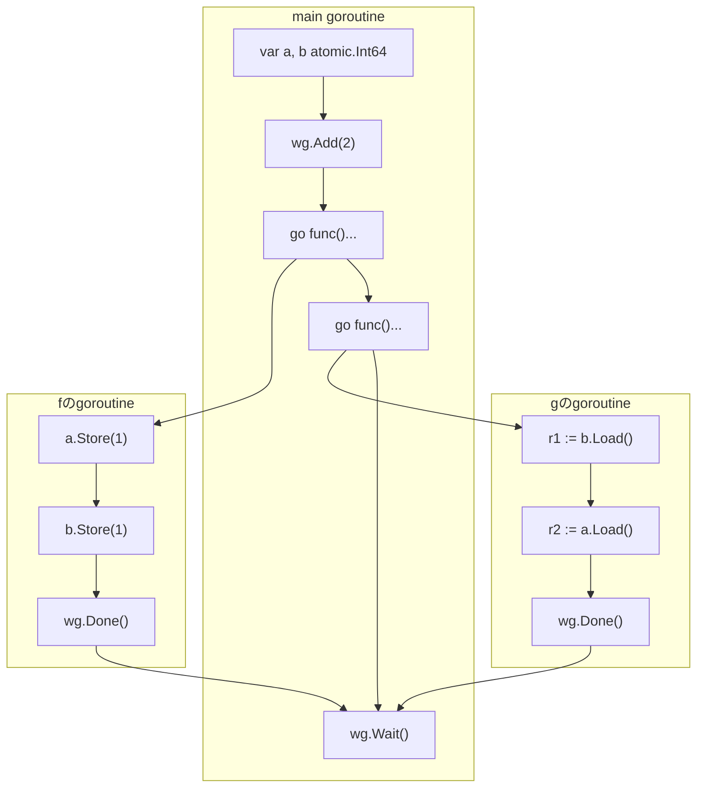
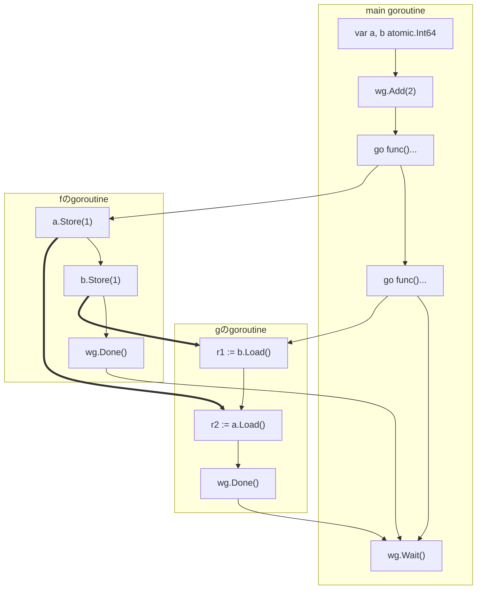
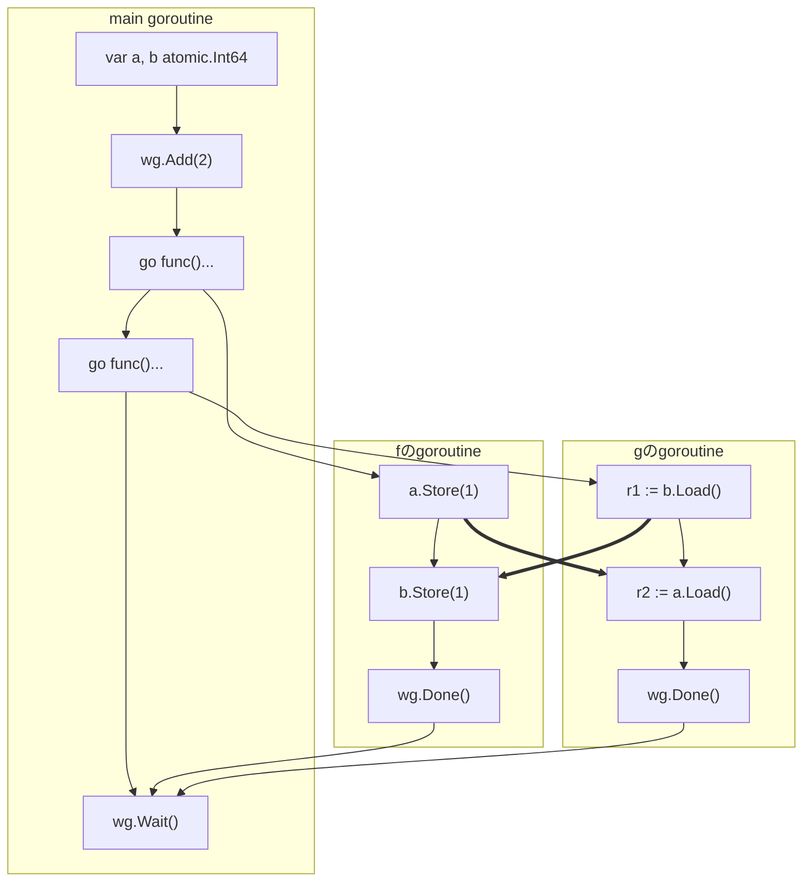

## Go1.19のメモリーモデルアップデート(8年ぶり)

Go 1.19では、The Go Memory Modelが8年ぶりに大きく改訂されました。C++やJava、Rustなど他言語のメモリーモデルと足並みをそろえる形で全体が書き直され、より正確でフォーマルな記述になりました。

## なぜsync/atomicについて話すのか

この章でsync/atomicを取り上げるのは、Go1.19メモリーモデルで記述が追加された部分であり、しかも同期演算の中でも特に理解しづらい部分だからです。前章で見た同期演算のリスト（channel、ロック、Onceなど）に、Go1.19からatomic演算が正式に加わった、という位置づけになります。

## sync/atomic入門

整数の値を1つインクリメントする`increment`関数を使って説明します。4つの書き方で`increment`を書いてみます。

```go
var x int64 = 0
var m sync.Mutex

// 単純なincrement.
// 並行プログラムでは意図通りに動かない
func increment() {
    x += 1
}

// Mutexを使ってインクリメント
func incrementByMutex() {
    m.Lock()
    x += 1
    m.Unlock()
}

// 同じことをatomicsで書く
func incrementByAtomics() {
    atomic.AddInt64(&x, 1)
}

// Go1.19からはatomics専用の型が使えます
// よりコンパクトで間違えにくい書き方ができます
var y atomic.Int64

func betterIncrementByAtomics() {
    y.Add(1)
}
```

## sync/atomicのメモリーモデル

The Go Memory Modelの「Atomic Values」の節を読んでみましょう。とても短い節です。

> The APIs in the sync/atomic package are collectively "atomic operations" that can be used to synchronize the execution of different goroutines. If the effect of an atomic operation A is observed by atomic operation B, then A is synchronized before B. All the atomic operations executed in a program behave as though executed in some sequentially consistent order.
>
> — [https://go.dev/ref/mem#atomic](https://go.dev/ref/mem#atomic) より

拙訳:

> sync/atomicパッケージのAPI群は、まとめて「atomic演算」と呼ばれ、異なるgoroutineの実行を同期するために使うことができる。atomic演算Aの効果がatomic演算Bによって観測されるならば、AはBよりsynchronized beforeである。プログラム内で実行される全てのatomic演算は、何らかの逐次一貫な順序で実行されたかのように振る舞う。

この短い記述に、2つの重要なルールが含まれています。

**ルール1: 観測がsynchronized before関係を作る**

atomic演算Bがatomic演算Aの効果を観測したならば、AからBへsynchronized beforeの矢印が引かれます。前章のchannelのように「send・receive」というペアが文法的に決まっているのではなく、**実際にどの書き込みの効果を観測したか**によって矢印が決まる、という点が特徴です。


*`a.Load()`が`a.Store(1)`の効果（値1）を観測したとき、そのときに限り、synchronized beforeの矢印が引かれる*

**ルール2: 全てのatomic演算は暗黙的全順序に従う**

プログラム内の全てのatomic演算は、「何らかの一列の順序（**暗黙的全順序**）で実行されたかのように」振る舞います。これは第4章のRequirement 2に登場した「同期演算の暗黙的全順序」が、atomic演算に対して具体化されたものです。

この2つを合わせると、「**sync/atomicだけで書かれたGoプログラムは逐次一貫モデルで説明できる**」ことになります。逐次一貫モデルとは、第2章のGopherくんの考え方でした。Gopherくんの考え方は一般のGoプログラムに対しては正しくありませんでしたが、atomic演算だけからなるプログラムに対してならば正しいのです。

sync/atomicとふつうの演算が混ざったプログラムの場合は次のようになります（※本書では割愛）。

1. まずatomic演算を一列に並べる方法（暗黙的全順序）を1つ選び、そこから決まるsynchronized before関係を求める
2. sequenced before関係・他の同期演算のsynchronized before関係と合わせてhappens-beforeグラフを作る
3. できあがったグラフから観測可能性を決定する

※もう少し詳しくは付録の章で説明します。

## 【練習】Quiz (Message Passing) のatomicバージョン

それを確かめるために、Message Passing Testをatomic型を使って書き換えた問題を考えてみます。`int64`の代わりに、`atomic.Int64`を使うようにしています。

```go
var a, b atomic.Int64 // 0で初期化
var wg sync.WaitGroup

func f() {
	defer wg.Done()
	a.Store(1)
	b.Store(1)
}

func g() {
	defer wg.Done()
	r1 := b.Load()
	r2 := a.Load()
	if r1 == 1 && r2 == 0 {
		panic("Answer: Yes")
	}
}

// 実験を1回行う関数
func exec() {
	wg.Add(2)
	defer wg.Wait()
	go f()
	go g()
}
```

### 先に実験しておく

**問題: `(r1, r2) = (1, 0)`となることはあるか？**

実験結果: **NO**。オリジナルのMessage Passing Testと違って、いくら回してもpanicは発生しません。


*atomic.Int64を使ったMessage Passing Testの実験。panicは発生しない*

### このクイズを解く手順

これをメモリーモデルの考え方で説明するには、一手間必要です。それはatomic演算同士の暗黙的全順序が「何らかの順序」としか決まっておらず、プログラムの実行ごとに異なりうるからです。そこで4つのatomic演算を一列に並べる方法（暗黙的全順序の候補）を全て列挙して、それぞれに対するグラフを使って観測可能性を求める流れになります。

1. 演算を図に書き起こす
2. 確定できる矢印を書き足す（sequenced beforeの矢印と、`go`文・WaitGroupが作るsynchronized beforeの矢印）
3. 4つのatomic演算を一列に並べる全てのパターン（暗黙的全順序の候補）を列挙する
   - それぞれのパターンに対して、そこから決まるsynchronized before関係の矢印を書き足す
   - それぞれのパターンに対して、できあがったグラフを使って観測可能性を判定する

まず、すでに学んだ方法で書ける部分についてはグラフを書き上げてしまいます。



### パターン1（※全部で6パターン）

4つのatomic演算を`a.Store(1)` → `r1 := b.Load()`のように一列に並べるパターンは、第2章で数えたのと同じく全部で6通りあります。

1つ目のパターンとして、`a.Store(1)` → `b.Store(1)` → `r1 := b.Load()` → `r2 := a.Load()`の順に並べた場合を考えます。この順序では、どちらのLoadも対応するStoreの効果を観測するので、ルール1により次の2つのsynchronized before関係をグラフに書き足します。

- `[a.Store(1)] < [r2 := a.Load()]`
- `[b.Store(1)] < [r1 := b.Load()]`


*パターン1のhappens-beforeグラフ。太い矢印が、このパターンの暗黙的全順序から決まるsynchronized before関係*

これで全ての矢印を書き込むことができました。このグラフから観測可能性を読み取ってみます。

- `b.Load()`は`b.Store(1)`だけを観測可能
- `a.Load()`は`a.Store(1)`だけを観測可能
- 故に`(r1, r2) = (1, 1)`

### パターン2（※全部で6パターン）

次に、4つのatomic演算を別な方法で並べるパターンを考えます。`a.Store(1)` → `r1 := b.Load()` → `r2 := a.Load()` → `b.Store(1)`のような並びです。このパターンに対しては、次の2つの順序関係をグラフに書き込みます。

- `[a.Store(1)] < [r2 := a.Load()]`
  - `a.Load()`が`a.Store(1)`の効果を観測するので、ルール1によるsynchronized before関係です
- `[r1 := b.Load()] < [b.Store(1)]`
  - こちらは観測によるものではなく、暗黙的全順序の中で`b.Load()`が`b.Store(1)`より先に来ることを表す矢印です。`b.Load()`は`b.Store(1)`の効果を観測できない（初期値しか観測できない）ことを意味します


*パターン2のhappens-beforeグラフ。パターン1と違い、`r1 := b.Load()`から`b.Store(1)`に向かって太い矢印が引かれている*

このグラフから観測可能性を読み取ると、

- `b.Load()`は初期化演算だけを観測可能
- `a.Load()`は`a.Store(1)`だけを観測可能
- 故に`(r1, r2) = (0, 1)`

となります。

### 残りのパターンと結論

パターンは全部で6パターンありますが、残りの4パターンは省略します。それぞれのパターンに対して別個のhappens-beforeグラフが作られます。これは、プログラムの実行ごとに異なるグラフになりうると考えてください。

残りの4パターンも考えると、どのhappens-beforeグラフに対しても`(r1, r2) = (1, 0)`とはならないことがわかります。

**結論: sync/atomicを使った場合のMessage Passingにおいて、`(r1, r2) = (1, 0)`となることはありえない**（※実験してもそのようなパターンは発生しない）

## Quiz (Message Passing Test) の結果を振り返って解釈する

- Message Passing Quizをsync/atomicで解いた場合の答えは、Message Passing Quizを逐次一貫モデルで解いた場合の結論と同じだった
- これは偶然ではなく、**sync/atomicだけを使って書いたプログラムは逐次一貫モデルで説明できる**という事実の一例になっている
- また、sync/atomicは単に「atomic(分割できない)」なだけでなく、**synchronized before関係を作り出す働き（同期演算としての性質）** も併せ持っている

## この章のまとめ

- Go1.19でメモリーモデルが8年ぶりにアップデートされ、sync/atomicについての記述が追加された
- atomic演算Aの効果をatomic演算Bが観測するとき、AはBよりsynchronized beforeである（ルール1）
- 全てのatomic演算は、何らかの暗黙的全順序で実行されたかのように振る舞う（ルール2）
- この2つのルールにより、sync/atomicだけで書かれたGoプログラムは逐次一貫モデルで説明できる
- atomic版Message Passing Testでは、暗黙的全順序の6パターンのどれを選んでも`(r1, r2) = (1, 0)`にならないことがグラフから導ける
- sync/atomicは「分割できない」だけでなく、synchronized before関係を作り出す同期演算としての性質も持つ

**Keywords:**

- sync/atomic
- 暗黙的全順序(implicit total order)
- synchronized before
