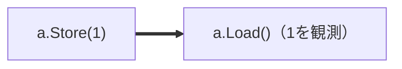
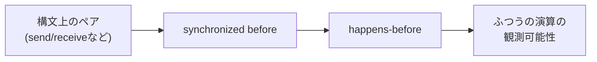
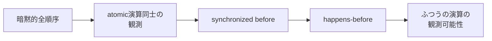
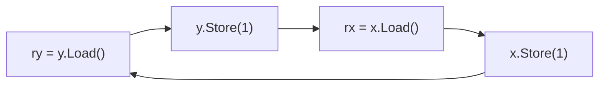
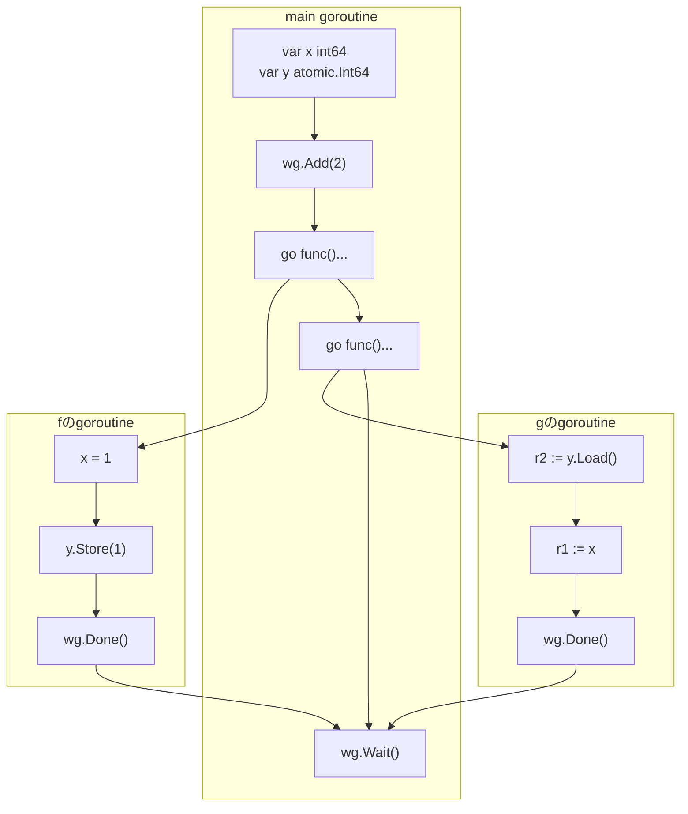
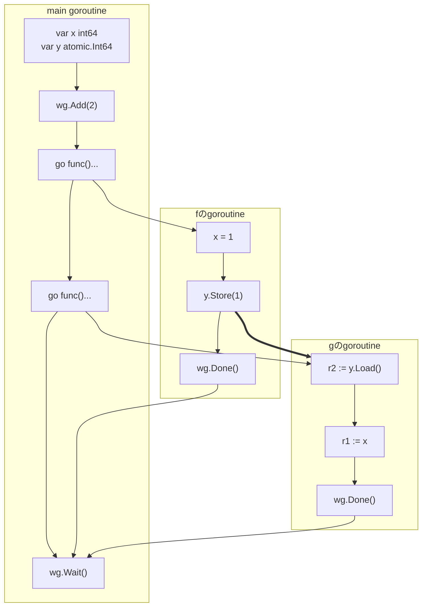
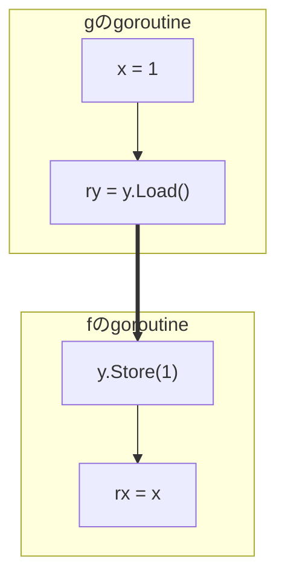

:::message
この章は、本書の中で最も進んだ内容を扱います。特に後半の「atomicsとふつうの演算が混ざったプログラム」の分析は一段難しいので、第5章までの内容を消化してから読むことをおすすめします。なお実用上は、「共有メモリーへの並行アクセスにはchannelやMutexなどの同期を使い、`-race`でテストする」という第5章までの知識で十分です。
:::

## Go1.19のメモリーモデルアップデート(8年ぶり)

Go 1.19では、The Go Memory Modelが8年ぶりに大きく改訂されました。C++やJava、Rustなど他言語のメモリーモデルと足並みをそろえる形で全体が書き直され、より正確でフォーマルな記述になりました。

## なぜsync/atomicについて話すのか

この章でsync/atomicを取り上げるのは、Go1.19メモリーモデルで記述が追加された部分であり、しかも同期演算の中でも特に理解しづらい部分だからです。前章で見た同期演算のリスト（channel、ロック、Onceなど）に、Go1.19からatomic演算が正式に加わった、という位置づけになります。Go1.18以前と比べて実際の挙動が変わったわけではなく、atomic演算について言及がなかったのがきちんと言及されるようになり、そのために必要な語彙も整備された形です。

## sync/atomic入門

整数の値を1つインクリメントする`increment`関数を使って説明します。4つの書き方で`increment`を書いてみます。

```go
var x int64 = 0
var m sync.Mutex

// 単純なincrement.
// 並行プログラムでは意図通りに動かない
func increment() {
    x += 1
}

// Mutexを使ってインクリメント
func incrementByMutex() {
    m.Lock()
    x += 1
    m.Unlock()
}

// atomicsを使ったインクリメント
var y atomic.Int64

func betterIncrementByAtomics() {
    y.Add(1)
}
```

## sync/atomicのメモリーモデル

The Go Memory Modelの「Atomic Values」の節を読んでみましょう。とても短い節です。

> The APIs in the sync/atomic package are collectively "atomic operations" that can be used to synchronize the execution of different goroutines. If the effect of an atomic operation A is observed by atomic operation B, then A is synchronized before B. All the atomic operations executed in a program behave as though executed in some sequentially consistent order.
>
> The preceding definition has the same semantics as C++'s sequentially consistent atomics and Java's volatile variables.
>
> — [https://go.dev/ref/mem#atomic](https://go.dev/ref/mem#atomic) より

拙訳:

> sync/atomicパッケージのAPI群は、まとめて「atomic演算」と呼ばれ、異なるgoroutineの実行を同期するために使うことができる。atomic演算Aの効果がatomic演算Bによって観測されるならば、AはBよりsynchronized beforeである。プログラム内で実行される全てのatomic演算は、何らかの逐次一貫な順序で実行されたかのように振る舞う。
>
> 上記の定義は、C++の逐次一貫atomicsやJavaのvolatile変数と同じ意味論を持つ。

この短い記述に、2つの重要なルールが含まれています。因果の流れに沿わせるため、引用の文とは順序を入れ替えて抜き出します。

**ルール1: 全てのatomic演算は暗黙的全順序に従う**

プログラム内の全てのatomic演算は、「何らかの一列の順序（**暗黙的全順序**）で実行されたかのように」振る舞います。特に、各Loadがどの値を読むか（＝どのStoreの効果を観測するか）は、この全順序で決まります。

**ルール2: 観測がsynchronized before関係を作る**

atomic演算Bがatomic演算Aの効果を観測したならば、AからBへsynchronized beforeの矢印が引かれます。前章のchannelのように「send・receive」というペアが文法的に決まっているのではなく、**実際にどの書き込みの効果を観測したか**によって矢印が決まる、という点が特徴です。


*`a.Load()`が`a.Store(1)`の効果（値1）を観測したとき、そのときに限り、synchronized beforeの矢印が引かれる*

この2つを合わせると、「**sync/atomicだけで書かれたGoプログラムは逐次一貫モデルで説明できる**」ことになります。逐次一貫モデルとは、第2章のGopherくんの考え方でした。Gopherくんの考え方は一般のGoプログラムに対しては正しくありませんでしたが、atomic演算だけからなるプログラムに対してならば正しいのです。

## 定義の向きが「逆転」していることに注意

ルール2をよく見ると、奇妙なことに気づきます。第5章の同期演算と、**定義の向きが逆**なのです。

channelやロックでは、`send`と`receive`、`Unlock`と`Lock`という**構文上のペアが先にsynchronized before関係を決め**、そこからhappens-beforeが決まり、最後にふつうの読み書きの観測可能性が決まりました。


*channel・ロックなど（第5章）: 順序が先に決まり、観測可能性が後から決まる*

一方atomicsでは、まず**暗黙的全順序がatomic演算同士の観測を決め**、その観測結果**から**synchronized before関係が導かれます。観測が先、順序が後です。


*atomics（この章）: atomic演算同士の観測が先に決まり、synchronized beforeは観測から導かれる*

この逆転した定義の意味は、atomicsだけのプログラムを見ていてもわかりません。atomicsだけの世界では、暗黙的全順序が読み込みの結果を全て決めてしまうので、そこから導かれるsynchronized before関係は**新しい情報を何も付け加えない**からです。導かれたsynchronized beforeが仕事をするのは、**ふつうの演算に順序を伝播させるとき**、つまりatomicsとふつうの演算が混ざったプログラムを分析するときです。

sync/atomicとふつうの演算が混ざったプログラムは、次の手順で分析します。

1. まずatomic演算を一列に並べる方法（暗黙的全順序）を1つ選び、そこから決まるsynchronized before関係を求める
2. sequenced before関係・他の同期演算のsynchronized before関係と合わせてhappens-beforeグラフを作る
3. できあがったグラフから観測可能性を決定する

この手順は、この章の後半の【ルール2の意味・本題】の節で実際に使います。その前に、まずatomicsだけのプログラムで「暗黙的全順序＝逐次一貫」を確かめておきましょう。

## 【練習】Quiz (Message Passing) のatomicバージョン

それを確かめるために、Message Passing Testをatomic型を使って書き換えた問題を考えてみます。`int64`の代わりに、`atomic.Int64`を使うようにしています。

```go
var a, b atomic.Int64 // 0で初期化
var wg sync.WaitGroup

func f() {
	defer wg.Done()
	a.Store(1)
	b.Store(1)
}

func g() {
	defer wg.Done()
	r1 := b.Load()
	r2 := a.Load()
	if r1 == 1 && r2 == 0 {
		panic("Answer: Yes")
	}
}

// 実験を1回行う関数
func exec() {
	wg.Add(2)
	defer wg.Wait()
	go f()
	go g()
}
```

### 先に実験しておく

**問題: `(r1, r2) = (1, 0)`となることはあるか？**

実験結果: **NO**。オリジナルのMessage Passing Testと違って、いくら回してもpanicは発生しません。


*atomic.Int64を使ったMessage Passing Testの実験。panicは発生しない*

**プログラム例:**

実験プログラムの完全版は次の通りです。第2章の実験プログラムと同じく、グローバル変数のリセットと繰り返し実行の`main`関数を追加しています。

```go
package main

import (
	"fmt"
	"sync"
	"sync/atomic"
)

var a, b atomic.Int64 // 0で初期化
var wg sync.WaitGroup

func f() {
	defer wg.Done()
	a.Store(1)
	b.Store(1)
}

func g() {
	defer wg.Done()
	r1 := b.Load()
	r2 := a.Load()
	if r1 == 1 && r2 == 0 {
		panic("Answer: Yes")
	}
}

// 実験を1回行う関数
func exec() {
	a.Store(0) // 前回の実験の結果をリセットする
	b.Store(0)
	wg.Add(2)
	defer wg.Wait()
	go f()
	go g()
}

func main() {
	for i := 0; i < 1_000_000; i++ {
		exec()
	}
	fmt.Println("panicは発生しませんでした")
}
```

👉 [Go Playgroundで実行する](https://go.dev/play/p/bt6jm-Y56-q)

第2章のオリジナル版と違い、こちらは実行環境によらず決してpanicしません。これはこの後説明するメモリーモデルの帰結です。また、全ての共有変数アクセスがatomic演算になっているので、`-race`オプション付きで実行してもdata raceは報告されません。

### 逐次一貫モデルで解ける

このプログラムの共有変数アクセスは全てatomic演算です。したがって、ルール1とルール2から導いた「sync/atomicだけで書かれたGoプログラムは逐次一貫モデルで説明できる」がそのまま使えます。つまり、**第2章でGopherくんがやった方法が、今度こそ正しい方法になります**。

4つのatomic演算を（同一goroutine内の順序を保って）一列に並べる方法は、第2章で数えたとおり全部で6通りです。そして第2章の表のとおり、どの並びでも`(r1, r2) = (1, 0)`にはなりません。よって答えは**NO**です。

ところで、この練習は暗黙的全順序（ルール1）だけで答えが出てしまい、ルール2のsynchronized beforeには出番がありませんでした。「定義の向きが逆転していることに注意」の節で述べたとおり、atomicsだけのプログラムではsynchronized beforeは新しい情報を生まないのです。そこで次の2つの節で、**ルール1が本当に仕事をする例**（Store Buffering）と、**ルール2が本当に仕事をする例**（half-atomicなMessage Passing）を順番に見ていきます。

## 【ルール1の意味】Store Buffering: 全順序だけが禁止できる結果

Message Passingは「書く側が2回書き、読む側が2回読む」形でした。今度は、2つのgoroutineがそれぞれ「**自分の変数に書いてから、相手の変数を読む**」という形を考えます。これは**Store Buffering**と呼ばれる有名なテストパターンです。

```go
var x, y int64 // どちらもふつうの変数

// fのgoroutineで実行される演算
y = 1  // (1) yへの書き込み
rx = x // (2) xからの読み込み

// gのgoroutineで実行される演算
x = 1  // (3) xへの書き込み
ry = y // (4) yからの読み込み
```

**問題: `(ry, rx) = (0, 0)`、つまり「どちらのgoroutineからも、相手の書き込みが見えない」ことはあり得るか？**

逐次一貫モデルで考えれば、答えはNOのはずです。4つの演算をどう一列に並べても、最初に来るのはどちらかの書き込み（(1)か(3)）であり、それに対応する読み込みは必ずその後に来るからです。たとえば(1)が最初なら、(4)は(1)より後なので`ry = 1`となります。

ところが、ふつうの変数を使ったこのプログラムには`x`・`y`どちらにもdata raceがあり、逐次一貫モデルは成り立ちません。実験してみましょう。

**プログラム例:**

```go
package main

import (
	"fmt"
	"sync"
)

var x, y int64 // どちらもふつうの変数
var rx, ry int64
var wg sync.WaitGroup

func f() {
	defer wg.Done()
	y = 1  // (1) yへの書き込み
	rx = x // (2) xからの読み込み
}

func g() {
	defer wg.Done()
	x = 1  // (3) xへの書き込み
	ry = y // (4) yからの読み込み
}

// 実験を1回行う関数
func exec() (int64, int64) {
	x, y, rx, ry = 0, 0, 0, 0
	wg.Add(2)
	go f()
	go g()
	wg.Wait()
	return ry, rx
}

func main() {
	counts := map[[2]int64]int{}
	for i := 0; i < 1_000_000; i++ {
		a, b := exec()
		counts[[2]int64{a, b}]++
	}
	for _, k := range [][2]int64{{0, 0}, {0, 1}, {1, 0}, {1, 1}} {
		fmt.Printf("(ry, rx) = (%d, %d): %d回\n", k[0], k[1], counts[k])
	}
}
```

👉 [Go Playgroundで実行する](https://go.dev/play/p/SSAVq94Y2rm)

筆者の環境（amd64）で実行した結果は次の通りで、`(ry, rx) = (0, 0)`が100万回中410回観測されました。

```
(ry, rx) = (0, 0): 410回
(ry, rx) = (0, 1): 993080回
(ry, rx) = (1, 0): 6510回
(ry, rx) = (1, 1): 0回
```

:::message
第2章のMessage Passing Testは、実行環境によっては（特にamd64では）なかなか再現しないのでした。一方このStore Bufferingは、**amd64でこそ容易に再現します**。amd64のCPUは書き込みをまず「ストアバッファ」という場所に溜めるため、(1)の書き込みが他のコアから見えるようになる前に、(2)の読み込みが実行されることがあるからです。「Store Buffering」という名前もここから来ています。（Go Playgroundでは実行環境の都合で観測されないこともあります。）
:::

### 両方atomicにすると(0, 0)は消える

次に、2つの変数を両方`atomic.Int64`にしてみます。

```go
var x, y atomic.Int64 // どちらもatomicな変数

// fのgoroutineで実行される演算
y.Store(1)    // (1)
rx = x.Load() // (2)

// gのgoroutineで実行される演算
x.Store(1)    // (3)
ry = y.Load() // (4)
```

👉 [Go Playgroundで実行する（実験プログラムの完全版）](https://go.dev/play/p/JFLIPsU3lJb)

筆者の環境での実測では、100万回中`(ry, rx) = (0, 0)`は**0回**でした。これはルール1（暗黙的全順序）の帰結として、次のように証明できます。`(0, 0)`になったと仮定すると、

- `ry == 0`なので、全順序Sの上で`[ry = y.Load()]`は`[y.Store(1)]`より前（後なら観測しているはず）
- `rx == 0`なので、S上で`[rx = x.Load()]`は`[x.Store(1)]`より前
- fの逐次順序より、S上で`[y.Store(1)]`は`[rx = x.Load()]`より前
- gの逐次順序より、S上で`[x.Store(1)]`は`[ry = y.Load()]`より前

これらを繋ぐと、順序が循環してしまいます。


*(0, 0)を仮定したときの、全順序S上の前後関係。矢印は「Sで前に来る」ことを表す（happens-beforeの矢印ではない）。循環しているので、このような一列の順序は存在しない*

一列に並んだ順序の中で循環はあり得ないので、矛盾。よって`(0, 0)`は不可能です。

### この結論はhappens-beforeグラフからは導けない

ここで大事な注意があります。いま示した「(0, 0)は不可能」という結論は、**happens-beforeグラフからは導けません**。

(0, 0)の実行を仮定しても、どちらのLoadも相手のStoreを観測していないので、ルール2のsynchronized before矢印は1本も引かれません。goroutineをまたぐ矢印が1本もない以上、hbグラフ上に矛盾は何もないのです。それでも(0, 0)が禁止されるのは、**暗黙的全順序が、happens-beforeとは独立の制約として働いている**からです。

第3章以来、私たちは「グラフを描いて読む」方法で全てを解いてきましたが、atomicsのルール1だけは、グラフではなく「**atomic演算を矛盾なく一列に並べられるか**」で考える必要があります。

## 【ルール2の意味・本題】half-atomicなMessage Passing

Message Passing Testの変数のうち、**フラグ役の`y`だけ**をatomicにして、データ役の`x`はふつうの変数のままにしてみます（本書では便宜的に「half-atomic版」と呼びます）。

```go
var x int64        // ふつうの変数
var y atomic.Int64 // atomicな変数

// fのgoroutineで実行される演算
x = 1      // (1) ふつうの書き込み
y.Store(1) // (2) atomicな書き込み

// gのgoroutineで実行される演算
r2 := y.Load() // (3) atomicな読み込み
r1 := x        // (4) ふつうの読み込み
```

**問題: `(r2, r1) = (1, 0)`となること、つまり「フラグ`y`は立っているのにデータ`x`が見えない」ことはあり得るか？**

### 確定できる矢印を書く

これまでと同じく、まず確定できる矢印（sequenced beforeと、`go`文・WaitGroupの矢印）でグラフを書きます。



### 暗黙的全順序は2パターンしかない

atomic演算は(2)と(3)の2つだけです。したがって暗黙的全順序の候補は「(2)→(3)」と「(3)→(2)」の2パターンだけです。そして重要なことに、**どちらのパターンだったのかは、(3)が観測した値`r2`を見ればわかります**。

**パターンA: (3)が1を観測した場合**（暗黙的全順序は (2)→(3)）

(3)が(2)の効果を観測したので、ルール2により`[y.Store(1)] < [r2 := y.Load()]`のsynchronized before矢印が引かれます。


*パターンAのhappens-beforeグラフ。観測から導かれたsynchronized before関係（太い矢印）が、fのgoroutineからgのgoroutineへの経路を作っている*

このグラフを読むと、`[x = 1] < [y.Store(1)] < [r2 := y.Load()] < [r1 := x]`、つまり`[x = 1] < [r1 := x]`です。間に`x`への他の書き込みはないので、観測可能性の条件1により、そして観測できる書き込みがこれ1つに絞られるので、**(4)は必ず1を観測します**。atomic演算(2)(3)の間の矢印が、ふつうの演算(1)(4)の間に順序を**伝播**させたわけです。これがsynchronized beforeの仕事です。

また、`[x = 1]`と`[r1 := x]`にはhappens-before関係があるので、**この実行にdata raceはありません**。

**パターンB: (3)が0（初期値）を観測した場合**（暗黙的全順序は (3)→(2)）

(3)は(2)の効果を観測していないので、ルール2の矢印は引かれません。暗黙的全順序の上では(3)が(2)より前に来ていますが、**この前後関係はhappens-before関係ではないので、グラフに矢印として描いてはいけません**（理由は後の「全順序をhappens-beforeの矢印にしてはいけない」の節で、実例とともに確認します）。したがってパターンBのグラフは、確定できる矢印だけのグラフのままです。


*パターンBのhappens-beforeグラフ。パターンAと違い、fのgoroutineからgのgoroutineへ向かう矢印が存在しない*

すると`[x = 1]`と`[r1 := x]`は並行です。同じ変数への書き込みと読み込みが並行で、どちらも同期演算ではないので、これは**data race**です。観測可能性の条件2により、`r1`は0も1もあり得ます。

### 分析のまとめと実験

| (3)の観測した値 | synchronized before矢印 | (4)の結果 | この実行のdata race |
| --- | --- | --- | --- |
| 1（パターンA） | あり | 必ず1 | なし |
| 0（パターンB） | なし | 0も1もあり得る | **あり** |

どちらのパターンでも`(r2, r1) = (1, 0)`にはならないので、**問題の答えはNO**です。フラグが立っているのを見たなら、データも必ず見えます。

**プログラム例:**

```go
package main

import (
	"fmt"
	"sync"
	"sync/atomic"
)

var x int64        // ふつうの変数
var y atomic.Int64 // atomicな変数
var wg sync.WaitGroup

func f() {
	defer wg.Done()
	x = 1      // (1) ふつうの書き込み
	y.Store(1) // (2) atomicな書き込み
}

func g() {
	defer wg.Done()
	r2 := y.Load() // (3) atomicな読み込み
	r1 := x        // (4) ふつうの読み込み
	if r2 == 1 && r1 == 0 {
		panic("(r2, r1) = (1, 0) が観測されました")
	}
}

// 実験を1回行う関数
func exec() {
	x = 0 // 前回の実験の結果をリセットする
	y.Store(0)
	wg.Add(2)
	defer wg.Wait()
	go f()
	go g()
}

func main() {
	for i := 0; i < 1_000_000; i++ {
		exec()
	}
	fmt.Println("(r2, r1) = (1, 0) は一度も観測されませんでした")
}
```

👉 [Go Playgroundで実行する](https://go.dev/play/p/OVSx8IwEBj6)

いくら繰り返しても`(r2, r1) = (1, 0)`は観測されず、panicしません。ところが、このプログラムを`-race`付きで実行すると、（パターンBの実行が1回でも混ざれば）**data raceが報告されます**。「panicは絶対に起きないのに、data raceはある」という、一見不思議なプログラムです。

### data raceは「実行」の性質、data race freeは「プログラム」の性質

この例は、data raceについての大事な事実を教えてくれます。**data raceがあるかどうかは、プログラムの実行ごとに決まる**、ということです。同じプログラムでも、パターンAの実行にはdata raceがなく、パターンBの実行にはdata raceがあります。単発で実行したときに`-race`がdata raceを「検出したりしなかったりする」のは、まさにこのためです。

一方、**data race free（DRF）は「プログラムの性質」**です。「どの実行を取ってもdata raceがない」とき、そのときに限り、そのプログラムはdata race freeであるといいます。第2章や第7章の「data raceのないプログラムは逐次一貫モデルで説明できる」の「data raceのないプログラム」とは、この意味です。上のプログラムは、パターンBというdata raceのある実行を持ちうるので、data race freeでは**ありません**。

### ガードすればdata race freeになる

では、このプログラムをdata race freeに直せるでしょうか。ポイントは、「(4)をパターンAの実行でしか実行しない」ようにすることです。

```go
func g() {
	defer wg.Done()
	if y.Load() == 1 { // (3) atomicな読み込み
		r1 := x // (4) ふつうの読み込み（(3)が1を観測したときだけ実行される）
		if r1 == 0 {
			panic("(r2, r1) = (1, 0) が観測されました")
		}
	}
}
```

こうすると、(4)が実行されるのは(3)が1を観測した実行、つまりパターンAだけになります。パターンAでは`[x = 1] < [r1 := x]`なのでdata raceはありません。パターンBでは(4)がそもそも実行されないので、やはりdata raceはありません。どの実行にもdata raceがないので、**このプログラムはdata race freeです**。`-race`付きでいくら実行しても、何も報告されません。

👉 [Go Playgroundで実行する（ガード付き版の完全なプログラム）](https://go.dev/play/p/1AxVHG5v8wt)

この「ふつうのデータをatomicなフラグで公開し、読む側はフラグを確認してからデータを読む」という形は、**publication**と呼ばれる実用的なイディオムです。第5章で見た`sync.Once`が「`f()`の完了が全ての`Do`のreturnよりsynchronized beforeになる」という保証を実現できるのも、内部でこれと同種の仕組みを使っているからです。

## 全順序をhappens-beforeの矢印にしてはいけない

パターンBのところで、「暗黙的全順序上の前後関係を、グラフの矢印として描いてはいけない」と述べました。最後にその理由を、実例で確認します。

もし「観測しなかったLoadからStoreへ」の矢印をhappens-before関係として描いてよいとしたら、何が導けてしまうでしょうか。Store Bufferingの`y`だけをatomicにした、half-atomic版のStore Bufferingで考えます。

```go
var x int64        // ふつうの変数
var y atomic.Int64 // atomicな変数

// fのgoroutineで実行される演算
y.Store(1) // (1) yへのatomicな書き込み
rx = x     // (2) xからのふつうの読み込み

// gのgoroutineで実行される演算
x = 1         // (3) xへのふつうの書き込み
ry = y.Load() // (4) yからのatomicな読み込み
```

`ry == 0`の実行、つまり(4)が(1)を観測しなかった実行を考えます。仮に(4)から(1)へhappens-beforeの矢印を描いてよいなら、次のグラフができます。


*「観測しないLoad→Store」の矢印（太線）を描いてしまった誤ったグラフ。`[x = 1]`から`[rx = x]`への経路ができてしまう（この図は誤った方法の帰結を示すためのものです）*

このグラフでは`[x = 1] < [rx = x]`が成り立つので、`ry == 0`のとき`rx == 1`が「保証」される、つまり`(ry, rx) = (0, 0)`は不可能、という結論になります。ところが実験してみると:

**プログラム例:**

👉 [Go Playgroundで実行する（実験プログラムの完全版）](https://go.dev/play/p/oudt4i-joxi)

筆者の環境（amd64）での実測では、100万回中`(ry, rx) = (0, 0)`が57回観測されました。

```
(ry, rx) = (0, 0): 57回
(ry, rx) = (0, 1): 993339回
(ry, rx) = (1, 0): 6601回
(ry, rx) = (1, 1): 3回
```

つまり、**観測しないLoadとStoreの間に矢印を描く方法は、実機の挙動に反する「偽の保証」を導いてしまう**のです。正しい分析はこうです: `ry == 0`の実行ではsynchronized beforeの矢印が1本もないので、`[x = 1]`と`[rx = x]`は並行＝data raceであり、`rx`は0も1もあり得ます。

:::message alert
**暗黙的全順序は、happens-beforeの矢印に変換してはいけません。**

第4章で引用したRequirement 2は、この区別を明言しています:

> Informally, the synchronized before relation is **a subset of the implied total order** mentioned in the previous paragraph, **limited to the information that W directly observes**.

synchronized before（＝矢印）になるのは、暗黙的全順序のうち**観測するという関係が成立したペアの間だけ**です。観測されなかったLoadとStoreの前後関係は、全順序の中には存在しますが、sequenced before関係を作りません。
:::

なお、両方の変数をatomicにすれば、【ルール2の意味】の節で見たとおり`(0, 0)`そのものが禁止されます。half-atomic版で`(0, 0)`を防げないのは、**全順序が縛るのはatomic演算だけ**であり、ふつうの変数`x`への保証は、観測から生じるsynchronized beforeを経由してしか伝わらないからです。ここが、ルール1（全順序）とルール2（観測→synchronized before）の役割の境界線です。

## 逐次一貫的ではないatomicsも存在しうる

先ほど引用した「Atomic Values」の節の最後には、Goのatomic演算が「C++の逐次一貫atomicsやJavaのvolatile変数と同じ意味論を持つ」と書かれていました。これは裏を返すと、**逐次一貫的ではないatomics**というものも世の中には存在する、ということです。

実際、C++やRustでは、より緩やかな性質を持つatomicsを選ぶことができます。このような選択肢のことを**メモリオーダリング**と呼びます。緩やかなatomicsを使うと、逐次一貫性の保証を一部手放す代わりに、より高速なコードが書ける場合があります。

一方、Go言語では逐次一貫的なatomicsだけが提供されており、メモリオーダリングを選ぶ余地はありません。このように設計された理由は [research!rsc: Updating the Go Memory Model (Memory Models, Part 3)](https://research.swtch.com/gomm) に詳しく書かれています。大まかに言えば、緩やかなatomicsは正しく使うことが極めて難しく、Goの「シンプルさ」の哲学に合わない、という判断です。

## この章のまとめ

- Go1.19でメモリーモデルが8年ぶりにアップデートされ、sync/atomicについての記述が追加された
- 全てのatomic演算は、何らかの暗黙的全順序で実行されたかのように振る舞う（ルール1）
- atomic演算Aの効果をatomic演算Bが観測するとき、AはBよりsynchronized beforeである（ルール2）
- この2つのルールにより、sync/atomicだけで書かれたGoプログラムは逐次一貫モデルで説明できる
- atomicsの定義は、第5章の同期演算と向きが逆転している。構文上のペアが順序を決めるのではなく、暗黙的全順序が決めた観測の結果からsynchronized before関係が導かれる
- Store Bufferingでは、ふつうの変数だと`(ry, rx) = (0, 0)`が実機（amd64）で観測されるが、両方atomicにすると暗黙的全順序上の循環矛盾により`(0, 0)`が不可能になる（ルール1の仕事）
- 「`(0, 0)`は不可能」という結論はhappens-beforeグラフからは導けない。暗黙的全順序は、happens-beforeとは独立の制約である
- **暗黙的全順序をそのままhappens-beforeの矢印に変換してはいけない**。synchronized beforeになるのは、全順序のうち観測(W)が直接示した部分だけ（half-atomic版Store Bufferingの`(0, 0)`実測がその反例になっている）
- 導かれたsynchronized beforeが仕事をするのは、ふつうの演算に順序を伝播させるときである。例えばhalf-atomic版Message Passingでは、atomicなフラグの観測に成功した実行で、ふつうのデータの読み込みが保証される
- data raceは「実行ごとの性質」であり、data race free（どの実行にもdata raceがないこと）は「プログラムの性質」である。`-race`が単発実行でdata raceを検出したりしなかったりするのはこのためである。
- C++やRustにはより緩やかなatomicsを選べる「メモリオーダリング」の仕組みがあるが、Goは逐次一貫的なatomicsだけを提供している

**Keywords:**

- sync/atomic
- 暗黙的全順序(implicit total order)
- synchronized before
- Store Buffering
- data race free (DRF)
- publication
- メモリオーダリング
