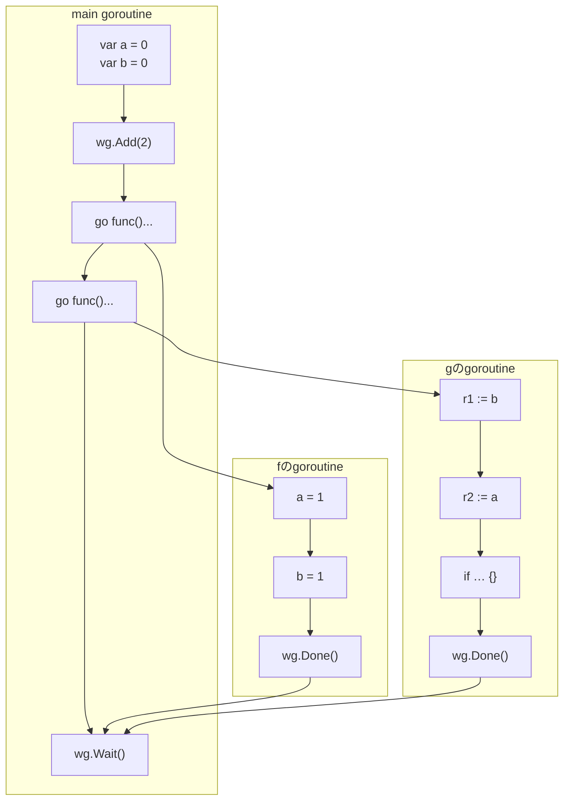

第3章の練習問題では結論だけを示しました。ここでは観測可能性の導出を詳しく追いかけます。

解き方の流れは次の3ステップです。

1. プログラムからメモリ演算を図に書き出す
2. 図にhappens-before関係を書き込んでグラフにする
3. 観測可能性の仕様を使って、`[r1 := b]`と`[r2 := a]`それぞれが観測可能な書き込み演算を全て求める

ステップ1と2を終えたグラフは次の通りです（第3章と同じもの）。

ここで、「メモリーモデルによる観測可能性の仕様」をもう一度貼り付けておきます。これを使って、`[r1 := b]`と`[r2 := a]`から観測できる書き込み演算を全て求めるのが目標です。

> 次の2つのうちどちらかの条件が成り立つとき、またその場合に限り、rはwを観測できる
> 1. `w < r`であり、かつ、`w < w' < r`となるような他の書き込み演算`w'`が存在しない
> 2. `r`と`w`が並行である

### `r1 := b`が観測可能な`b`への書き込み演算を全て求める

- 初期化の`[var b = 0]`
  - `[var b = 0] < [r1 := b]`
  - この2つの間に`b`への書き込みはない
  - よって`[r1 := b]`は`[var b = 0]`を**観測可能**
- `f`のgoroutineの`[b = 1]`
  - `[b = 1] < [r1 := b]`ではない
  - `[r1 := b] < [b = 1]`でもない
  - つまり2つは並行
  - よって`[r1 := b]`は`[b = 1]`を**観測可能**

### `r2 := a`が観測可能な`a`への書き込み演算を全て求める

- 初期化の`[var a = 0]`
  - `[var a = 0] < [r2 := a]`
  - この2つの間に`a`への書き込みはない
  - よって`[r2 := a]`は`[var a = 0]`を**観測可能**
- `f`のgoroutineの`[a = 1]`
  - `[a = 1] < [r2 := a]`ではない
  - `[r2 := a] < [a = 1]`でもない
  - つまり2つは並行
  - よって`[r2 := a]`は`[a = 1]`を**観測可能**

以上により、`r1`も`r2`も0と1のどちらの値も取りうるので、`(r1, r2) = (1, 0)`もあり得ることが導けました。
