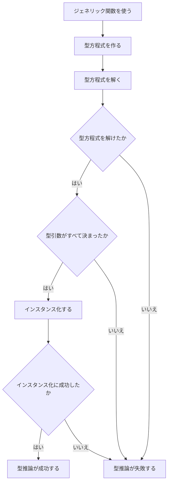
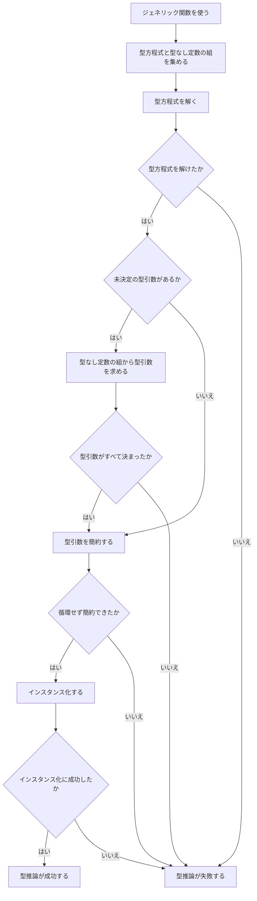

前の章では、現在のGoで利用できる型推論のパターンを見ました。
この章では、そのうち最も分かりやすい例を使って、型推論の全体像を説明します。

Goの型推論には追加の処理が必要になるケースもありますが、それらを最初から一度に考えると、処理の中心が見えにくくなります。

そこで、まずは型方程式を作って解くだけで型引数がすべて決まるケースを扱います。このケースでは、untyped constant（型なし定数）のための処理を考える必要がありません。

そのあとで、型方程式だけでは型引数が決まらないケースも含めた一般的な流れを確認します。ここでは全体の見取り図だけを示し、細かい規則は必要になる箇所で順番に説明します。

## インスタンス化と型推論

型推論を理解する前に、インスタンス化との関係を確認しておきましょう。

ジェネリック関数を実際に使うためには、型パラメータに型引数を代入して、ジェネリックではない関数にする必要があります。
この処理をインスタンス化といいます。

<!-- zenncode: skip -->
```go
func G[T any](t T) {}

var x int
G[int](x)
```

この例では、型パラメータ`T`に型引数`int`を代入します。
すると、`G`は概念的には次のような関数になります。

<!-- zenncode: skip -->
```go
func G(t int)
```

[仕様書のInstantiations節](https://go.dev/ref/spec#Instantiations)では、インスタンス化を次の2段階で説明しています。

1. 型パラメータを対応する型引数で置き換える
2. それぞれの型引数が、対応する型制約を満たすことを確認する

型引数をすべて明示した場合、どの型引数を使うかはコードに書かれています。
一方、次のように型引数を省略した場合は、インスタンス化より前に不足している型引数を決めなければなりません。

<!-- zenncode: skip -->
```go
G(x)
```

この不足している`int`を決める処理が型推論です。

型推論はインスタンス化の代わりではありません。
型推論によって型引数を補ったあと、その型引数を使ったインスタンス化が行われます。

## この章で扱う例

まずは、先ほどの`G`の呼び出しだけを使って単純な処理を追います。

<!-- zenncode: skip -->
```go
func G[T any](t T) {}

var x int
G(x)
```

型推論を始める時点では、`T`の型引数が分かっていません。
最終的に次の対応を得ることが目標です。

```text
T ➞ int
```

この例では、実引数`x`は変数なので、その型`int`がすでに決まっています。型なし定数のための処理は必要ありません。型推論に必要な情報を型方程式として表し、その型方程式を解くだけで型引数が決まります。

## 型推論の入力と出力

この例の型推論を一つの処理として見ると、入力と出力は次のように整理できます。

| 種類 | 内容 |
| --- | --- |
| 入力 | 型引数を省略して使われたジェネリック関数`G` |
| 入力 | 実引数`x`の型`int` |
| 入力 | 型パラメータ`T`の型制約`any` |
| 出力 | `T`に対応する型引数`int` |

より一般には、型引数を一部だけ明示した場合、その明示された型引数も入力になります。
また、前の章で見たように、代入先として要求される関数型が入力になる場合もあります。

## 型推論が行われる場面

現在の型推論は、大きく分けて次の二つの場面で行われます。

1. ジェネリック関数やジェネリックメソッドを呼び出す場面
2. ジェネリック関数やジェネリックメソッドに、ジェネリックではない関数型が要求される場面

二つ目には、前の章で見た変数への代入、別の関数の引数、戻り値、関数型への変換などが含まれます。

どちらの場合も、ジェネリック関数の型と、その使用箇所で得られる型との関係が型推論の手がかりになります。

## 型推論に使われる関係

[仕様書のType inference節](https://go.dev/ref/spec#Type_inference)では、型推論に使われる型同士の関係として、主に次の二つを挙げています。

1. ある型の値が別の型へ代入可能でなければならない
2. 型引数が、対応する型パラメータの型制約を満たさなければならない

`G(x)`では、実引数`x`を仮引数`t`へ渡します。
そのため、実引数の型`int`と仮引数の型`T`との間に関係が生まれます。

また、`T`には`any`という型制約があります。
推論される型引数は、この型制約を満たさなければなりません。

## 型方程式

仕様書では、型推論に使われる型同士の関係を型方程式として表します。

この章で使う型方程式は次の二種類です。

| 式 | 表す関係 |
| --- | --- |
| `X ≡A Y` | 代入可能性の規則に従って、型`X`と型`Y`が一致する |
| `P ≡C C` | 型パラメータ`P`の型引数が型制約`C`を満たす |

`G(x)`からは、次の型方程式が得られます。

```text
T ≡A int
T ≡C any
```

一つ目は、実引数の型`int`と仮引数の型`T`の関係を表します。
二つ目は、`T`に宣言された型制約を表します。

型推論は、これらの型方程式をどちらも成立させる`T`の型引数を探します。

## 型方程式を解く

それでは、この例の型方程式を順番に見てみましょう。

最初の型方程式は次のものです。

```text
T ≡A int
```

`T`の型引数はまだ分かっていません。
この関係を成立させるため、`T`の型引数として`int`を得ます。

```text
T ➞ int
```

次に、`T`の型制約から得られた型方程式を見ます。

```text
T ≡C any
```

すでに`T`の型引数は`int`だと分かっています。
`int`は`any`を満たすため、この型方程式も成立します。

これで、すべての型方程式を成立させる型引数が決まりました。

この章の例では、型方程式を解いた結果として、必要な型引数がすべて具体的な型として得られます。

## 単純な場合の流れ

ここまで見てきた、型なし定数を考えなくてよい場合の処理を、型推論の開始からインスタンス化まで並べると次のようになります。



`G(x)`の場合は、次のように進みます。

```text
実引数と仮引数の関係を得る
    ↓
Tの型制約との関係を得る
    ↓
二つの型方程式を作る
    ↓
T ➞ int を得る
    ↓
G[int]をインスタンス化する
```

この流れが、これから仕様書を読むための基本形になります。

## 一般的な場合の流れ

単純な例では、型方程式を解くだけですべての型引数が決まりました。しかし、一般にはそれだけで処理が完結するとは限りません。

たとえば、実引数が`1`のような型なし定数で、対応する仮引数の型が推論対象の型パラメータそのものである場合、その組は型方程式にはせず、型なし定数と型パラメータの組として別に集められます。型方程式を処理したあとにも型引数が決まっていなければ、この情報から型引数を求めます。

さらに、得られた型引数に別の推論対象の型パラメータが含まれていれば、それを対応する型引数で繰り返し置き換えて簡約します。循環して簡約できない場合は型推論に失敗します。

これらを含めた全体の流れは次のようになります。



この図のうち、単純な`G(x)`では「型なし定数の組から型引数を求める」処理を通りません。また、`T ➞ int`には別の推論対象の型パラメータが含まれないため、簡約もそのまま終わります。

一般的な流れに現れる型なし定数、型引数の簡約、循環参照については、後の章でそれぞれ具体例を使って説明します。

## 型制約の確認

型パラメータの型制約からも、型推論で扱う型方程式が作られます。
ただし、この例の制約`any`は`T`の型を絞り込む情報を与えません。
実引数から`T ➞ int`が得られたあと、`int`と`any`が両立することを確認するだけです。

必要な型引数がすべて決まったあとは、その型引数でインスタンス化できるかを確認します。

`G[int]`をインスタンス化するときは、次のことが確認されます。

- `int`が制約`any`を満たす

型方程式から型引数の候補を得られても、その型引数でインスタンス化できなければ型推論は成功しません。

## 型推論が成功する条件

型推論の成功条件は、次の二つにまとめられます。

1. 省略された型引数をすべて推論できる
2. 推論された型引数を使ったインスタンス化に成功する

この章の例では、`T`の型引数を`int`と推論でき、`int`が型制約`any`を満たすため、型推論に成功します。

逆に、型方程式をすべて成立させる型引数を得られない場合や、得られた型引数でインスタンス化できない場合は、型推論に失敗します。

より複雑な失敗の仕方については、その処理が必要になる章で具体例を使って説明します。

## 仕様書の構成

この章で見た基本的な流れは、主に仕様書の次の二つの場所に書かれています。

| 仕様書の場所 | 主な内容 |
| --- | --- |
| [Instantiations](https://go.dev/ref/spec#Instantiations) | 型引数の代入と型制約の確認、型引数を省略できる場面 |
| [Type inference](https://go.dev/ref/spec#Type_inference) | 型同士の関係、型方程式、型引数を求める処理 |

Type inference節の後半や仕様書末尾のAppendixには、型方程式を処理するためのより細かい規則があります。
しかし、最初からそこまで同時に読む必要はありません。

この本では、まずType inference節を上から順番に読みます。
その中で細かい規則が必要になった時点で、対応する説明へ進みます。

## この章のまとめ

- 型推論は、省略された型引数を決める処理である
- 型推論によって型引数を補ったあと、その型引数でインスタンス化する
- 実引数と仮引数の関係や型制約を、型方程式として表す
- 型方程式を成立させる型引数を求めることで、`T ➞ int`のような結果を得る
- 型方程式だけで型引数が決まらない場合は、型なし定数について別に集めた情報も使う
- 得られた型引数に推論対象の型パラメータが残る場合は、繰り返し置き換えて簡約する
- 型推論が成功するには、すべての型引数が決まり、その型引数でインスタンス化できなければならない
- より複雑な処理は、必要になる章で順番に扱う

次の章から、Type inference節を上から順番に読んでいきます。
