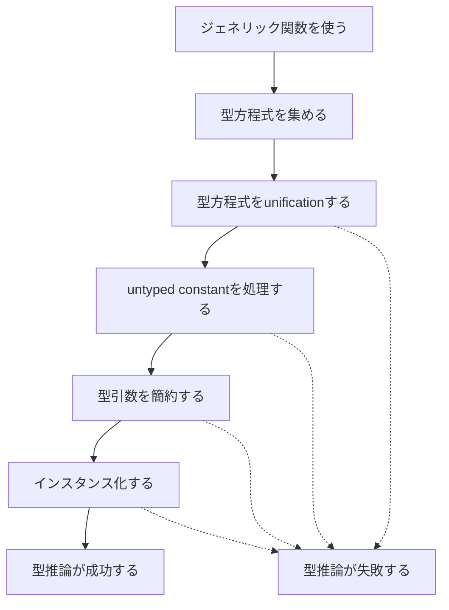

前の章では、現在のGoで利用できる型推論のパターンを見ました。
この章では、それらの型推論がどのような処理によって実現されているのかを大まかに説明します。

この段階では、個々の規則を正確に覚える必要はありません。
まず「仕様書のどの部分が、処理全体のどこを説明しているのか」を把握することが目標です。

## インスタンス化と型推論

型推論を理解する前に、インスタンス化との関係を確認しておきましょう。

ジェネリック関数を実際に使うためには、型パラメータに型引数を代入して、ジェネリックではない関数にする必要があります。
この処理をインスタンス化といいます。

<!-- zenncode: skip -->
```go
func first[S ~[]E, E any](s S) E {
	return s[0]
}

first[[]string, string]([]string{"hello"})
```

この例では、型パラメータ`S`に`[]string`を、`E`に`string`を代入します。
すると、`first`は概念的には次のような関数になります。

<!-- zenncode: skip -->
```go
func first(s []string) string
```

[仕様書のInstantiations節](https://go.dev/ref/spec#Instantiations)では、インスタンス化を次の2段階で説明しています。

1. 型パラメータを対応する型引数で置き換える
2. それぞれの型引数が、対応する型制約を満たすことを確認する

型引数をすべて明示した場合、どの型引数を使うかはコードに書かれています。
一方、次のように型引数を省略した場合は、インスタンス化より前に不足している型引数を決めなければなりません。

<!-- zenncode: skip -->
```go
first([]string{"hello"})
```

この不足している`[]string`と`string`を決める処理が型推論です。

型推論はインスタンス化の代わりではありません。
型推論によって型引数を補ったあと、必ずその型引数を使ったインスタンス化が行われます。

## 型推論の入力と出力

型推論を一つの処理として見ると、入力と出力は次のように整理できます。

| 種類 | 内容 |
| --- | --- |
| 入力 | 型引数を省略して使われたジェネリック関数やメソッド |
| 入力 | 明示された型引数があれば、その型引数 |
| 入力 | 実引数の型や、代入先として要求される関数型 |
| 入力 | 各型パラメータの型制約 |
| 出力 | 省略された各型パラメータに対応する型引数 |
| 失敗 | 必要な型引数を決められない、または決めた型引数でインスタンス化できない |

たとえば`first([]string{"hello"})`では、型推論の対象となる型パラメータは`S`と`E`です。
最終的に次の対応が得られれば、型引数を補うことができます。

```text
S ➞ []string
E ➞ string
```

## 型推論が行われる場面

現在の型推論は、大きく分けて次の二つの場面で行われます。

1. ジェネリック関数やジェネリックメソッドを呼び出す場面
2. ジェネリック関数やジェネリックメソッドに、ジェネリックではない関数型が要求される場面

二つ目には、前の章で見た変数への代入、別の関数の引数、戻り値、関数型への変換などが含まれます。

どちらの場合も、ジェネリック関数の型と、その使用箇所で得られる型との関係が型推論の手がかりになります。

## 型推論に使われる情報

型推論に使われる情報には、いくつかの出どころがあります。

| 情報の出どころ | 例 | 得られる関係 |
| --- | --- | --- |
| 関数呼び出し | `first(xs)` | 実引数`xs`の型と仮引数の型 |
| 既知の関数型 | `var f func(int) = G` | `G`の型と`func(int)` |
| 型制約 | `S ~[]E` | `S`の型引数が満たすべき制約 |
| untyped constant | `f(1)` | 定数のkindと仮引数の型パラメータ |

型の付いた実引数や既知の関数型から得られる情報と、型制約から得られる情報は、型方程式として表現されます。

一方、型の付いていない定数であるuntyped constantは、通常の型方程式とは分けて収集され、あとで処理されます。
この違いは、型推論が二つのフェーズに分かれる理由になります。

## 型方程式

[仕様書のType inference節](https://go.dev/ref/spec#Type_inference)では、型推論に使われる型同士の関係を型方程式として表します。

型方程式の代表的な種類は次の二つです。

| 式 | 表す関係 |
| --- | --- |
| `X ≡A Y` | 代入可能性の規則に従って、型`X`と型`Y`が一致する |
| `P ≡C C` | 型パラメータ`P`の型引数が型制約`C`を満たす |

`first([]string{"hello"})`からは、概略として次の型方程式が得られます。

```text
S ≡A []string
S ≡C ~[]E
E ≡C any
```

一つ目は、実引数の型`[]string`が仮引数の型`S`に渡されることから得られます。
二つ目と三つ目は、`S`と`E`に宣言された型制約から得られます。

型推論は、これらの関係をすべて成立させる`S`と`E`の型引数を探します。
次の章からは、型方程式がどこから作られるのかを仕様書の順番に沿って詳しく見ていきます。

## type unification

型方程式を解くために使われる処理がtype unificationです。

[仕様書のType unification節](https://go.dev/ref/spec#Type_unification)では、型方程式の左辺と右辺を再帰的に比較し、両者が一致するために必要な型引数を探す処理として説明されています。

たとえば、`S`と`[]string`を比較した時点で`S`の型引数がまだ決まっていなければ、次の対応を記録できます。

```text
S ➞ []string
```

その後、`S`の制約`~[]E`を調べると、`[]string`と`[]E`の要素型を比較することによって、さらに次の対応を得られます。

```text
E ➞ string
```

仕様書の説明では、型推論全体が型方程式を集め、必要に応じてtype unificationを呼び出します。
type unificationは、二つの型と、それらをどの程度厳密に一致させるかを表すmatching modeを使って比較を進めます。

そのため、type unificationだけが型推論のすべてを行うわけではありません。
untyped constantの処理、型引数の簡約、最後のインスタンス化などは、type unificationの外側にある処理です。

## 型推論の流れ

ここまでの内容を、型推論の開始からインスタンス化の成功まで並べると次のようになります。



仕様上、型方程式のunificationとuntyped constantの処理は、型推論の二つのフェーズとして明示されています。

1. 型方程式をtype unificationによって解く
2. まだ型引数が決まっていない型パラメータについて、対応するuntyped constantのdefault typeを使う

二つのフェーズが終わっても型引数が決まっていない型パラメータがあれば、型推論は失敗します。

また、推論された型引数の中に別の型パラメータが残る場合があります。
その場合は、その型パラメータを対応する型引数で繰り返し置き換えて簡約します。
循環参照があって簡約できない場合も、型推論は失敗します。

## 型制約の確認

型推論中には、型制約から作られた型方程式も使われます。
この処理によって、`first`の`E`のように、型制約から別の型引数が推論されることがあります。

ただし、型制約を型推論の手がかりに使うことと、最終的な型引数が型制約を満たすことを確認することは区別できます。

型推論によって必要な型引数がすべて決まったあと、その型引数でインスタンス化します。
インスタンス化では、型引数を型パラメータへ代入したうえで、それぞれの型引数が対応する型制約を満たすか確認します。

`first[[]string, string]`では、少なくとも次のことが確認されます。

- `[]string`が、`E`を`string`で置き換えた制約`~[]string`を満たす
- `string`が制約`any`を満たす

この確認に失敗すると、型引数の候補を得られていても、インスタンス化に失敗します。

## 型推論が成功する条件

型推論の成功条件は、次の二つにまとめられます。

1. 省略された型引数をすべて推論できる
2. 推論された型引数を使ったインスタンス化に成功する

逆に、次のいずれかが起きると型推論は失敗します。

| 失敗する場所 | 例 |
| --- | --- |
| type unification | 同じ型パラメータについて両立しない型が要求される |
| untyped constantの処理 | constant kindが競合する |
| 二つのフェーズの終了時 | 必要な型引数が決まっていない |
| 型引数の簡約 | 型パラメータを介した循環参照がある |
| インスタンス化 | 型引数が型制約を満たさない |

この表の各項目は、後続の章で具体的なコードを使って説明します。

## 仕様書の構成

Goの仕様書で型推論を読むときは、次の四つの場所を行き来することになります。

| 仕様書の場所 | 主な内容 |
| --- | --- |
| [Instantiations](https://go.dev/ref/spec#Instantiations) | 型引数の代入と型制約の確認、型引数を省略できる場面 |
| [Type inference](https://go.dev/ref/spec#Type_inference) | 型方程式、型推論の対象、二つのフェーズ、型引数の簡約 |
| [Type unification](https://go.dev/ref/spec#Type_unification) | 型方程式の両辺を比較して型引数を探す処理 |
| [Type unification rules](https://go.dev/ref/spec#Type_unification_rules) | exactとloose、bound type parameterなどの詳細な比較規則 |

本文のType inference節には、型推論の目的、入力となる型同士の関係、型方程式の作り方、二つのフェーズ、簡約がこの順番で書かれています。
その途中にType unificationの説明があります。

一方、細かいtype unification rulesは仕様書末尾のAppendixにあります。
本文を読んでいる途中で比較規則の正確な条件が必要になった場合は、Appendixを参照することになります。

この本では、まずType inference節を上から順番に読み、その後でType unificationとAppendixの規則を詳しく扱います。

## この章のまとめ

- 型推論は、省略された型引数を決める処理である
- 型推論によって型引数を補ったあと、インスタンス化が行われる
- 型推論は、実引数、既知の関数型、型制約などから型同士の関係を集める
- 型同士の関係は型方程式として表され、type unificationによって解かれる
- untyped constantの処理と型引数の簡約は、type unificationとは別の処理である
- 型推論が成功するには、すべての型引数が決まり、その型引数でインスタンス化できなければならない
- 詳細なtype unification rulesは仕様書末尾のAppendixにある

次の章から、Type inference節を上から順番に読んでいきます。
