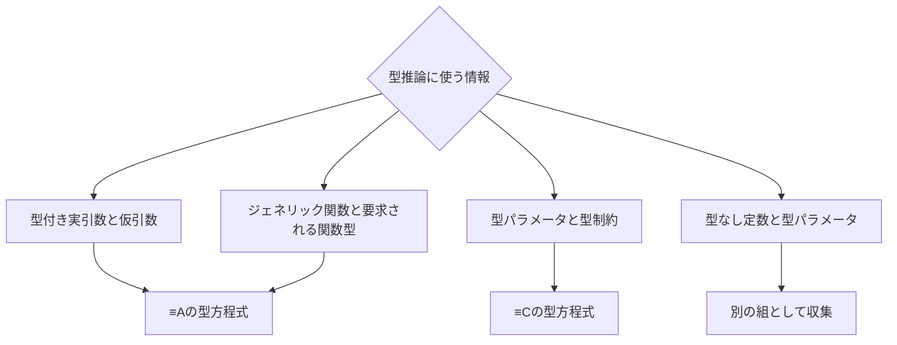

前章では、型推論を「型方程式を作り、その未知数にあたる型パラメータの型引数を求める処理」として眺めました。

この章では、型方程式が何を表し、Goプログラムのどこから作られるのかを詳しく見ていきます。

仕様書に現れる型方程式は、次の2種類です。

| 記号 | 表す関係 |
| --- | --- |
| `X ≡A Y` | `X`と`Y`が代入可能性の規則にもとづいて対応する |
| `P ≡C C` | 型パラメータ`P`が型制約`C`を満たす |

仕様書では、`A`と`C`は下付き文字で書かれています。本書では読みやすさのため、`≡A`、`≡C`と書きます。

ここでいう「方程式」は、数式の等号のように左右がまったく同じものだという意味ではありません。型推論において満たすべき型同士の関係を表しています。

## 関数呼び出しから得られる≡A

まずは前章と同じ例を使います。

<!-- zenncode: skip -->
```go
func G[T any](t T) {}

var x int
G(x)
```

関数呼び出し`G(x)`が有効であるためには、実引数`x`を仮引数`t`に渡せなければなりません。

- 実引数`x`の型は`int`
- 仮引数`t`の型は`T`

したがって、`int`と`T`の間には、実引数の型を仮引数の型へ代入できるような関係が必要です。

一般に、関数呼び出し`f(a₀, a₁, …)`の実引数`aᵢ`と、それに対応する仮引数`pᵢ`から、次の型方程式が作られます。

```text
typeof(pᵢ) ≡A typeof(aᵢ)
```

`G(x)`に当てはめると、次のようになります。

```text
T ≡A int
```

この式を成立させる型引数として、`T ➞ int`が得られます。

## ≡Aは代入可能性そのものではない

実際の関数呼び出しには「実引数から仮引数へ」という向きがあります。しかし、仕様書は型推論を単純にするため、代入の向きを無視して`≡A`を対称な型方程式として扱います。

そのため、次の2つは型推論では同じ式です。

```text
T ≡A int
int ≡A T
```

これは、Goの代入可能性そのものが対称だという意味ではありません。「値`x`を型`Y`の変数へ代入できる」ことから、逆向きの代入も可能になるわけではありません。対称なのは、型推論のために作られた`≡A`という型方程式です。

したがって、`X ≡A Y`を「`X`は`Y`へ代入可能である」と読むと、式に実際の代入方向が保存されているように聞こえてしまいます。`X`と`Y`が「代入可能性の規則にもとづいて対応する」と捉える方が正確です。

## 関数型との照合から得られる≡A

`≡A`は、通常の関数呼び出しにおける実引数と仮引数だけから作られるわけではありません。

たとえば、ジェネリック関数を既知の関数型の変数へ代入できます。

<!-- zenncode: skip -->
```go
func G[T any](t T) {}

var f func(int) = G
```

右辺の`G`は、型引数を補う前には概念的に`func(T)`という関数型を持ちます。一方、左辺では`func(int)`が要求されています。

このように、ジェネリック関数`f`をジェネリックではない関数型`F`に対応させる文脈からは、次の型方程式が作られます。

```text
typeof(f) ≡A F
```

上の例では、概念的には次の式になります。

```text
func(T) ≡A func(int)
```

関数の引数型を対応させることで、ここでも`T ➞ int`が得られます。

## ≡Aの出どころ

現在のGoで`≡A`が作られる場面を、利用できるようになったバージョンとともに整理すると次のようになります。

- 通常のジェネリック関数呼び出しにおける、型の付いた実引数と仮引数の対（Go 1.18）
- ジェネリック関数を実引数として別の関数へ渡す呼び出し（Go 1.21）
- ジェネリック関数を既知の関数型の変数へ代入する文脈（Go 1.21）
- ジェネリック関数を戻り値として返す文脈（Go 1.21）
- 関数型への変換を含む、ジェネリック関数と関数型との照合が必要なその他の文脈（Go 1.27）
- 以上の文脈でジェネリックメソッドを使う場合（Go 1.27）

この一覧は第1章で見た型推論のパターンに対応しています。表面的には異なる書き方でも、型推論では「2つの型を対応させる`≡A`の型方程式を作る」という共通の形に整理されます。

## 型制約から得られる≡C

型パラメータには、それぞれ対応する型制約があります。推論された型引数は、その型制約を満たさなければなりません。

型パラメータ`Pₖ`と、それに対応する型制約`Cₖ`からは、次の型方程式が作られます。

```text
Pₖ ≡C Cₖ
```

前の`G`では、型パラメータ`T`の型制約は`any`です。

```text
T ≡C any
```

仕様書は`X ≡C Y`を「`X` satisfies constraint `Y`」と説明しています。したがって、この式は「`T`は型制約`any`を満たす」と読めます。

`≡C`の型方程式は、型パラメータとその型制約の対ごとに常に作られます。`any`のように型引数を絞り込む情報をほとんど持たない制約からも作られます。

別の型パラメータを含む制約は、その型パラメータを推論する手がかりにもなります。

<!-- zenncode: skip -->
```go
func first[S ~[]E, E any](s S) E {
	return s[0]
}
```

この宣言からは、次の`≡C`の型方程式が作られます。

```text
S ≡C ~[]E
E ≡C any
```

たとえば別の型方程式から`S ➞ []string`が得られれば、`S ≡C ~[]E`を通して`E ➞ string`を得られます。詳しい処理は、次章の`dedup`の例で追います。

## ≡Cは対称ではない

`≡C`には左右それぞれの役割があります。

- 左辺は型パラメータ
- 右辺は、その型パラメータに対応する型制約

`P ≡C C`は「`P`が`C`を満たす」という方向のある関係です。そのため、`≡C`は対称ではありません。

```text
T ≡C any
```

この左右を入れ替えた`any ≡C T`は、同じ意味の式にはなりません。右辺を左辺の制約として解釈するという役割そのものが変わってしまうからです。

## 型方程式の両辺

`≡A`と`≡C`は、どちらも仕様書では型方程式と呼ばれます。しかし、両辺の役割は同じではありません。

| 記号 | 左辺 | 右辺 | 対称か |
| --- | --- | --- | --- |
| `≡A` | 型 | 型 | 型推論では対称 |
| `≡C` | 型パラメータ | 対応する型制約 | 対称ではない |

`≡A`の両辺には型を置きます。型パラメータも型なので、単純な`T ≡A int`だけでなく、次のような複合型も両辺に置けます。

```text
[]P ≡A []string
func(P) P ≡A func(int) int
[10]struct{ elem P; list []P } ≡A [10]struct{ elem string; list []string }
```

`≡C`の右辺は型制約です。型制約はインターフェースで表されますが、`~[]E`のように制約でのみ使える型項を含むこともあります。そのため、`≡C`まで含めて「両辺には同じ意味で型が置かれる」と捉えるより、右辺には型制約が置かれると区別した方が分かりやすいでしょう。

## 型方程式にならない情報

型推論に使われる情報のすべてが、型方程式になるわけではありません。

実引数が`1`や`"hello"`のようなuntyped constant（型なし定数）で、対応する仮引数の型が今回の推論対象である型パラメータそのものである場合、その組は`≡A`の型方程式にはしません。

<!-- zenncode: skip -->
```go
func F[T any](t T) {}

F(1)
```

この例では、`1`と`T`を次のような組として別に集めます。

```text
(1, T)
```

型方程式を先に処理したあとにも`T`の型引数が決まっていなければ、この組から定数のdefault typeである`int`を使います。

```text
T ➞ int
```

型なし定数を型方程式から分けるのは、型の付いたオペランドから得られる情報を優先するためです。この2段階の処理は、後の「型推論の2つのフェーズ」の章で詳しく扱います。

型推論の入力がどのように分類されるかをまとめると、次のようになります。



## Go 1.18の説明との対応

Go 1.18の仕様では、型推論を次の2種類に分けて説明していました。

| Go 1.18での分類 | 現在の仕様で対応する情報 |
| --- | --- |
| function argument type inference | 実引数と仮引数から作られる`typeof(pᵢ) ≡A typeof(aᵢ)` |
| constraint type inference | 型パラメータと型制約から作られる`Pₖ ≡C Cₖ` |

現在の仕様では、これらを共通の型方程式の集まりとして扱えます。この見方では、Go 1.18の2種類の型推論は、現在の型方程式の主な出どころに対応しています。

ただし、これは歴史的な対応であり、現在の型推論の入力を完全に2つへ分類するものではありません。

- 現在の`≡A`は、通常の実引数と仮引数だけでなく、ジェネリック関数と要求される関数型からも作られる
- 型なし定数は通常の型方程式にはせず、別の情報として集められる

Go 1.18以降に新しい利用場面が増えても、既存の型方程式に加えて別種の式を次々に増やすのではなく、`≡A`を作る文脈を広げる形で説明できるようになっています。

## 記号を英語で読む

仕様書は、`≡A`や`≡C`の公式な読み上げ方を定めていません。そのため、記号を機械的に読むより、表している関係を英語で説明する方が誤解が少なくなります。

| 式 | 自然な英語での読み方 |
| --- | --- |
| `X ≡A Y` | “X and Y match under assignability rules.” |
| `P ≡C C` | “P satisfies constraint C.” |
| `P ➞ A` | “P maps to A.” または “A is inferred for P.” |

特に`X ≡A Y`を“X is assignable to Y”と読むと、通常の代入方向を表すように聞こえるため避けます。

## G(x)から得られる情報

最後に、最初の例をもう一度まとめます。

<!-- zenncode: skip -->
```go
func G[T any](t T) {}

var x int
G(x)
```

この例からは、次の2つの型方程式が得られます。

```text
T ≡A int
T ≡C any
```

`T ≡A int`から型引数の候補`int`が得られ、`T ≡C any`ではその候補と制約の関係を確認できます。その結果、`T`の型引数として`int`を使えます。

```text
T ➞ int
```

この例では型パラメータが1つだけなので、関係は単純です。次章では仕様書の`dedup`の例を読み、複数の型パラメータを含む型方程式から、型引数が順に明らかになる様子を見ていきます。

## 参考

- [Go言語仕様 Type inference](https://go.dev/ref/spec#Type_inference)
- [Go 1.21 Release Notes](https://go.dev/doc/go1.21)
- [Goの型推論 — 仕様に基づく概略](https://github.com/nobishino/go-typeinfer-theorem/blob/docs/type-inference-primer/docs/GO-TYPE-INFERENCE.md)
